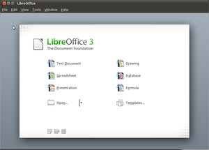



.. index::
   Open ODF

.. _open_odf:

===================
Open ODF
===================

.. seealso::

   - https://secure.wikimedia.org/wikipedia/en/wiki/OpenDocument

The Open Document Format for Office Applications (also known as OpenDocument
or ODF) is an XML-based file format for representing electronic documents such
as spreadsheets, charts, presentations and word processing documents.

While the specifications were originally developed by Sun Microsystems, the
standard was developed by the OASIS Open Document Format for Office
Applications (OpenDocument) TC - OASIS ODF TC,[2] committee of the Organization
for the Advancement of Structured Information Standards (OASIS) consortium and
based on the XML format originally created and implemented by the OpenOffice.org
office suite (see OpenOffice.org XML).

In addition to being an OASIS standard, it is published (in one of its
version 1.0 manifestations) as an ISO/IEC international standard,
ISO/IEC 26300:2006 Open Document Format for Office Applications
(OpenDocument) v1.0.[3]

The most common filename extensions used for OpenDocument documents are:

- .odt for word processing (text) documents
- .ods for spreadsheets
- .odp for presentations
- .odb for databases
- .odg for graphics
- .odf for formulae, mathematical equations

odt2sphinx
==========

.. seealso:: :ref:`odt2sphinx`

.. index::
   LibreOffice

LibreOffice
===========

.. seealso::

   - https://secure.wikimedia.org/wikipedia/en/wiki/LibreOffice

LibreOffice is an office suite that is compatible with other major office
suites,  and available on a variety of platforms. Its goal is to produce
a vendor-independent office suite with ODF support and without any copyright
assignment requirements.

The name is a hybrid word with the first part Libre, which means free
(as in freedom) in both Spanish and French and the English word Office.

As free software, users are free to download, modify, use and distribute
LibreOffice.

Odfpy
=====

.. seealso:: http://odfpy.forge.osor.eu/

Odfpy is a library to read and write OpenDocument v. 1.1 files. The main focus
has been to prevent the programmer from creating invalid documents. It has
checks that raise an exception if the programmer adds an invalid element, adds
an attribute unknown to the grammar, forgets to add a required attribute or
adds text to an element that doesn't allow it.

These checks and the API itself were generated from the RelaxNG schema, and
then hand-edited. Therefore the API is complete and can handle all ODF
constructions, but could be improved in its understanding of data types.

.. index::
   webodf

WebODF
======

.. image:: webodf.png

.. seealso::

   - http://webodf.org/
   - http://gitorious.org/odfkit/webodf
   - https://demo.webodf.org/demo/

WebODF is a JavaScript library that makes it easy to add Open Document Format
(ODF) support to your website and to your mobile or desktop application.

It uses HTML and CSS to display ODF documents.
