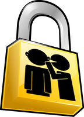



.. index::
   ! Privacy box

.. _privacy_box:

==============================
Privacy box , Rebellyon
==============================

.. seealso:: 

   - http://rebellyon.info/Un-formulaire-securise-a-la.html

   

.. contents::
   :depth: 3

Introduction
============

Un formulaire sécurisé à la Wikileaks pour envoyer des infos et des documents 
à Rebellyon

Afin de permettre à tout le monde de nous envoyer des informations et des 
documents de manière sécurisée, et éventuellement anonyme, le collectif 
d’animation de Rebellyon_ met en place une **Privacy Box**. 

Détails pratiques
=================

En gros il s’agit d’un bête for­mu­laire d’envoi d’email, sauf que celui-ci sera 
ensuite crypté ainsi que les docu­ments que vous pour­rez join­dre à votre mes­sage 
(plus pré­ci­sé­ment, ils seront chif­frés avec la tech­ni­que de chif­fre­ment asy­mé­tri­que). 

L’ensem­ble du ser­vice mis en place par la fon­da­tion alle­mande Pryvacybox.de 
permet de garan­tir votre ano­ny­mat.

Lancé par la Privacy Foundation alle­mande, une ONG de défense de la vie privée 
et de la liberté d’expres­sion, pri­va­cy­box.de fait encore mieux, dans la mesure 
où elle permet à tous ceux qui ne peu­vent ou ne veu­lent pas uti­li­ser GPG ou 
PGP d’écrire de façon confi­den­tielle, ano­nyme et sécu­ri­sée, à tout jour­na­liste, 
blo­gueur ou inter­naute qui, uti­li­sa­teur de GPG ou de PGP, s’y est ins­crit 
(et c’est gra­tuit, for­cé­ment, et puis facile, aussi). 

Si vous en avez marre de l’omerta de la presse com­mer­ciale lyon­naise sur toute 
une série de sujets, si vous dési­rez rendre public des docu­ments sans ris­quer 
que la DCRI vous retrouve, en cho­pant par exem­ple les fadet­tes de votre 
inter­lo­cu­teur, ou en remon­tant des envois de mails... envoyez-nous par ce 
for­mu­laire vos infos ! : https://privacybox.de/rebellyon.msg

La fia­bi­lité des docu­ments et infor­ma­tions sera ensuite véri­fiée avant 
publi­ca­tion. Si vous sou­hai­tez que nous puis­sions vous recontac­ter, 
n’oubliez pas d’indi­quer un moyen de vous join­dre (ça peut être via une 
autre pri­va­cy­box par exem­ple).

Pour renforcer votre anonymat Anonymiser votre connexion inter­net à la Privacybox :

Il est pos­si­ble de se connec­ter de deux maniè­res qui per­met­tent d’invi­si­bi­li­ser 
com­plè­te­ment à quel site vous vous connec­tez, Tor ou I2P. 

Ces deux maniè­res de se connec­ter néces­si­tent d’avoir cer­tains logi­ciels 
ins­tal­lés. Les adres­ses de la pri­va­cy­box de Rebellyon sont alors :

- si TOR est activé sur votre ordi­na­teur : http://c4wcxidkfhvmzhw6.onion/rebel­lyon.msg
- via I2P, le projet Internet furtif : http://pri­va­cy­box.i2p/rebel­lyon.msg

Effacer les traces infor­ma­ti­ques vous iden­ti­fiant des docu­ments que vous nous 
pro­po­sez:

- pour les docu­ments texte : il est conseillé de les trans­for­mer en pdf. 
  Les docu­ments word peu­vent en effet conte­nir des infor­ma­tions sur votre 
  ordi­na­teur si vous avez édité le docu­ment. Si vous ne savez pas le faire, 
  nous le ferons dès récep­tion et détrui­rons le fichier conte­nant 
  des infor­ma­tions.
- pour les images : votre appa­reil photo ou votre télé­phone ins­crit des 
  méta­don­nées, dans vos photos, per­met­tant l’iden­ti­fi­ca­tion de l’appa­reil 
  ayant servi à la prise de vue. Il existe des logi­ciels pour cela si vous 
  êtes amené à le faire régu­liè­re­ment, notam­ment ExiftoolGUI [4] 
  Pour les effa­cer sans logi­ciel dédié, il faut éditer la photo dans un 
  logi­ciel d’édition d’image (The Gimp, Photoshop, voire Paint), sélec­tion­ner 
  l’ensem­ble de la photo, copier, créer un nou­veau docu­ment et coller 
  l’image dedans, puis réen­re­gis­trer avec un nou­veau nom de fichier. 
  Idem, si vous n’y arri­vez pas, nous le ferons dès récep­tion.

Si vous n’êtes pas sûrs de l’ordi­na­teur que vous uti­li­sez (risque de mou­chard 
logi­ciel, main­te­nant prévu dans la loi) nous vous conseillons d’uti­li­ser 
un live CD Linux sécu­risé (qui uti­lise Tor par défaut) : par exem­ple Tails_. 
Ou si vous vous sentez par­ti­cu­liè­re­ment sur­veillés, uti­li­sez un autre 
ordi­na­teur avec ce live CD sécu­risé.

Enfin, vous pouvez dépo­ser des let­tres dans notre boîte située à 
La Gryffe, 5 rue Sébastien Gryphe, Lyon 7e ou nous les faire par­ve­nir par 
voie pos­tale de la même manière, mais là, malgré toute l’estime que nous 
por­tons à nos cama­ra­des fac­teurs et fac­tri­ces, on ne garan­tie rien.

.. _Tails: http://tails.boum.org/

Tails
=====

.. seealso:: http://tails.boum.org/

Tails est un live CD ou live USB dont le but est de préserver votre vie privée 
et anonymat.

Il vous permet de :

- utiliser Internet de manière anonyme (presque) partout et avec n'importe 
  quel ordinateur; toutes les connexions sortantes vers Internet sont obligées 
  de passer par le réseau Tor_ ;
- ne pas laisser de traces sur l'ordinateur utilisé, à moins que vous ne le 
  demandiez explicitement.

.. _Tor: https://www.torproject.org/

Notes
=====

[1]
    Pour une introduction plus détaillée de ce service, on pourra lire 
    PrivacyBox : permettre l’envoi d’emails chiffrés aux personnes qui n’ont 
    pas (encore) de clés PGP.

[2]
    Extrait de Gorge profonde, mode d’emploi, un article de Jean-Marc Manach, 
    auteur du site Bug Brother.

[3]
    Dont une présentation assez complète a été publiée sur Rebellyon : 
    L’anonymat sur Internet grâce à la technique du routage en oignon.

[4]
    http://u88.n24.queensu.ca/bogdan/  Exiftool GUI qui permet, entre autres, 
    d’enlever toutes les métadonnées ou certaines, au choix.
   
ExifToolGUI ne se suffit pas à lui-même, c’est une interface graphique sur un 
programme en ligne de commande. Il faut :

- aller le télécharger là (Windows Executable) : 
  http://www.sno.phy.queensu.ca/ phil/exiftool
- extraire le contenu du .zip le fichier
- renommer le fichier exiftool(-k).exe en exiftool.exe ou exiftool(-k) en 
  exiftool
- copier ou déplacer le fichier renommé.

.. _Rebellyon: http://rebellyon.info 

