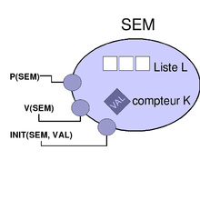


.. index::
   pair: programming ; semaphore
   pair: concurrent ; semaphore
   ! semaphore

.. _semaphore:

==================================
Semaphore
==================================

.. seealso::

   - http://fr.wikipedia.org/wiki/S%C3%A9maphore_%28informatique%29
   - http://en.wikipedia.org/wiki/Semaphore_%28programming%29

   Sémépahore

.. contents::
   :depth: 3

Introduction
=============

Un sémaphore est une variable (ou un type de donnée abstrait) et constitue la
méthode utilisée couramment pour restreindre l'accès à des ressources partagées
(par exemple un espace de stockage) dans un environnement de programmation
concurrente.

Le sémaphore a été inventé par Edsger Dijkstra et utilisé pour la première fois
dans le système d'exploitation THE Operating system.

Les sémaphores fournissent la solution la plus courante pour le fameux problème
du « dîner des philosophes », bien qu'ils ne permettent pas d'éviter tous les
interblocages (ou deadlocks).

Pour pouvoir exister sous forme logicielle, ils nécessitent une implémentation
matérielle (au niveau du microprocesseur), permettant de tester et modifier la
variable protégée au cours d'un cycle insécable.
En effet, dans un contexte de multiprogrammation, on ne peut prendre le risque
de voir la variable modifiée par un autre processus juste après que le
processus courant vient de la tester et avant qu'il ne la modifie.

Semaphore Implementation
========================

.. toctree::
   :maxdepth: 4

   csharp_semaphore
   csharp_semaphore_slim
   python_semaphore
