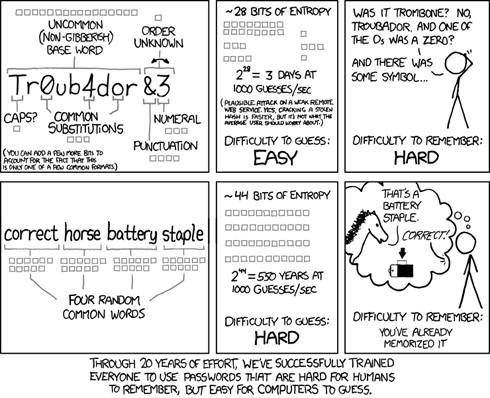



.. index::
   pair: Cryptographie ; phrase secrète
   pair: Cryptographie ; phrase de passe
   pair: Cryptography ; passphrase
   pair: Cryptography ; password
   
.. _phrase_de_passe:

======================
Phrase de passe
======================

.. seealso::

   - http://fr.wikipedia.org/wiki/Phrase_secr%C3%A8te
   - http://en.wikipedia.org/wiki/Passphrase
   - :ref:`privacy`

   
   http://www.panoptinet.com/archives/4623 (Pourquoi nos mots de passe sont-ils nuls)

.. contents::
   :depth: 3

Definitions
===========

English
-------

A passphrase is a sequence of words or other text used to control access to a
computer system, program or data.

A passphrase is similar to a password in usage, but is generally longer for
added security.

Passphrases are often used to control both access to, and operation of, cryptographic
programs and systems.

Passphrases are particularly applicable to systems that use the passphrase as
an encryption key.

The origin of the term is by analogy with password. The modern concept of
passphrases is believed to have been invented by Sigmund N. Porter in 1982.

Français
---------

Le terme de phrase secrète ou phrase de passe est couramment employé pour
désigner un mot de passe d'un nombre important de caractères.
En effet, les mots de passe couramment utilisés sont souvent sans espaces et
d'une longueur maximale de 8 à 10 caractères. Mais dans certains domaines, en
particulier la cryptographie, le niveau de sécurité requis exige des mots de
passe beaucoup plus longs.

.. toctree::
   :maxdepth: 4

   tools/index

