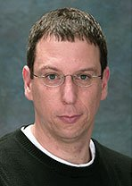


.. index::
   pair: Dan; Boneh
   pair: Crypto; Class
   ! Dan Boneh

.. _dan_boneh:

===================
Dan Boneh
===================

.. seealso::

   - http://crypto.stanford.edu/~dabo/
   - http://www.crypto-class.org/

Professor of Computer Science and Electrical Engineering, Stanford University.

Professor Dan Boneh heads the applied cryptography group at the Computer Science
department at Stanford University. Professor Boneh's research focuses on
applications of cryptography to computer security. His work includes cryptosystems
with novel properties, web security, security for mobile devices, digital
copyright protection, and cryptanalysis. He is the author of over a hundred
publications in the field and a recipient of the Packard Award, the
Alfred P. Sloan Award, and the RSA award in mathematics.

Last year Dr. Boneh received the Ishii award for industry education innovation.

Professor Boneh received his Ph.D from Princeton University and joined Stanford
in 1997.

