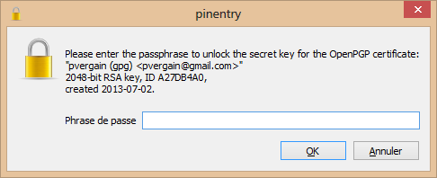


.. index::
   pair: GnuPG; Encryption
   pair: Chiffrage; Encryption
   pair: ASCII ; Armor
   pair: gpg ; encrypt
   pair: gpg ; recipient
   pair: gpg ; armor
   pair: gpg ; output
   
         
.. _gnupg_cli1_encrypt:

=================================================================
``gpg`` encrypt commands
=================================================================

   
.. contents::
   :depth: 3   

Encryption (``gpg`` [--options] ``--encrypt`` file)
=====================================================

You encrypt files by using the ``--encrypt`` command and specifying the file or 
data to be encrypted::

    C:\Tmp>gpg --encrypt my_file.txt
    Vous n'avez pas spécifié de nom d'utilisateur. (vous pouvez utiliser -r)

    Récipients actuels:

    Entrez le nom d'utilisateur, en terminant par une ligne vide: pvergain@gmail.com
    gpg: automatically retrieved `pvergain@gmail.com' via Local

    Récipients actuels:
    2048R/A27DB4A0 2013-07-02 "pvergain (gpg) <pvergain@gmail.com>"

    Entrez le nom d'utilisateur, en terminant par une ligne vide:

    D:\TEMP>

	

If you don't specify a recipient with your command, GPG prompts you to specify 
a recipient (whose public key must be on your keyring). 

Once you specify a recipient, GPG encrypts your file (my-file.txt) to a similarly 
named file with the extension .GPG (my-file.gpg)::

    Répertoire de C:\Tmp
    09/01/2014  08:36             3 254 my_file.txt
    09/01/2014  08:38             2 142 my_file.txt.gpg

::

    C:\Tmp>type my_file.txt.gpg
    hÊ<~Aäå]ê∟#░s◄►ªKªÜ\=☺6┌¬<ÿIçb$▒u╠hdSø_│ùz☺Êä@Úðâ­4×±kÔ½9←÷Rn├◄▀)G£¸ÑcQ_pî▬¸óª╝3♣5ø╣ù*S☺░Þ♀?¹a♂ü%Ö4«_∟IèÒ▄ña▓┴:V├{¯ñ┤►╚ÈÖ¬♠r│)▓ÀÇ`yäñ░¨ƒıfÊо┌ê²o>ÁüsûiÊ æN↕bP§ëi▼¥Ò▼9 ¿x¨Á%°

You can avoid bring prompted for a recipient by specifying a ``--recipient`` 
as an **option**.

::

    gpg --recipient pvergain@gmail.com --encrypt my_file.txt
    
::
    
    gpg: automatically retrieved `pvergain@gmail.com' via Local
	

Notice that the ``--recipient`` option comes before the ``--encrypt`` command.

In both of the examples we've looked at, GPG encrypts the file (my_file.txt) 
and produces a similarly named file (my_file.txt.gpg) as output. 

This new output file is an **encrypted (ciphertext)** version of the original 
plaintext file, but is is a binary file. 

The contents of this encrypted binary file will look like gobbledygook when 
opened with a simple text editor like Notepad. Binary files are perfectly fine 
to send intact to a recipient "as is," however, they can present problems if 
you want to send  the encrypted contents (the ciphertext) in the body of an 
email message.  

If you want to work with the encrypted contents (ciphertext) of your file in 
text format, there is a solution. GPG allows you to encrypt your file to a special 
format known as ASCII Armor. You can send the ASCII Armored contents in the body 
of an email message.

To encrypt your file and produce an ASCII Armored file as the output, use the 
``--armor`` option. Remember that options precede commands::

    gpg --recipient pvergain@gmail.com --armor --encrypt my_file.txt

::

    dir my*
    
::
    
    09/01/2014  08:36             3 254 my_file.txt
    09/01/2014  09:02             3 045 my_file.txt.asc

::

    type my_file.txt.asc 
    

::    
    
    -----BEGIN PGP MESSAGE-----
    Version: GnuPG v2.0.17 (MingW32)

    hQEMA4qREP6ifbSgAQf/UorCeoUWQrBOcHU5vPNmz1ZKjPOjdpADwTWikLprb/cZ
    Enmv3C4rUzQPYK1OGxDMO7YXZuKAYbeZdPa58Ts39dsw885a6LopHN+DtpiTmm2+
    VFl4ApX4lD6wSHsTvFN8OXGmRubc963RySz+BASJQ39t9HkW7Zl0RvHQR6+9Tmw2
    bVPct0H6SVtMyjYfUo10zBFA/iCD98FI/H/v06S2aDsTGMU498/9Dh2TFMbw9TcN
    jlEpPHvuo2Qdm4dy9kABQh13t7SLfMU5lRCBKSDBwenRU/zCsZRyDuuBzDboUM9m
    v2ZPU7xLyZMcU21aUsF1jKp67KaK5IErkGpXgBwTxtLqAT/qeaZY4cx73qYPrwB7
    U6qRHIJJjMJppEjNHvyfE9tPMuyLMmW9XeELYCptVSYeDA9xBtKGxEWjWOEdPN1W
    4TitF+J4GT8G5UT1eZ+o/KjFT1le9bNjBr0F72hGh+oPeBmznY81iJDpZwHQnjQc
    CCE1PkHY5hDwv3UK2vSMvWFMkYIEku2gxMDiuvNbGEh4ZlD9h6y7OnTgCmUk2DBY
    UJdfyyL5c04P3gLxkaqvQwyinLZnlNgnn6t5lRAsnVYabw8dgieoxq/Ac97Apj17
    h5DMNlPoMaW7FaY8b6MqDORxup/6UPZ4QjwjZ1Mi9aLC5eITn/OJveex6Rxyhvoa
    dIgWliYKQ399FGNVT3n6zTCB4XIhvQKmzFot58syw9e2KeCeC2vPWXZpvlvq6v1u
    cWwMMViqjdAx7Ri1CIIkS3ZNQ1rec/LIhOVri46HeQdwqwR3K7YNqTvvfB2o9h/g
    UrdixVyLwiiV7ikrFSJ78O35MnsktwNmneP6BT2Rr2CbZ3krTndWCiSNHt2s68l1
    rY30wNciiGV3EVcmV07NIGiB1tx3toMtJLCgZRjh4BJVu24T8RCtwWk/3iWsaa76
    MfarEmTmfUcRECjDU7AQaycX2HEJEwLZGMlXmcF60/sXBYU3V1o3TqiZ8ygyU95S
    e8dH8frJTXAtpFAteHSfj3JavkBE8v1k+5yC/O630ABUHQ+J+0ZlP5X2j7EVCtk6
    iI+MtJoyC48VczPyXfa9WhjYfl635qkHhulSoHybTWMUnpSpeV8nHBNLZ184W/WE
    BpZ7tsITvwMTeUJ9xVcIkRXUvQVjnG1IlsGdkd9yxLBjQTU+XGO3qP1MhN/OxiB/
    HE4dbSPhkEU9muVNXZkSug0XYtuDOz1JvaGZp/ptCF9idNPE3RrNfXImxtKFDo3+
    FyUOyHTnWu9h+FGAA0w4DEv/45Lm3k0KfYFwMXvd++4KFsodAFTjQPXzulp45frl
    elsbtQ/ALuopyE6ETp6OITU5UfJ4nZpLNSs4TUf7nyU47Tg3yY9RswH8LEmJvLUU
    QTSIPO9rLMZvHSJ2iA9PvxMOc9h9R6n3sozZhYV+qbcrWxgLGqfDPjd0kJ7mMoSi
    Yh2DicjeTIOe4Rxflpo/QDk9beAWPDYadm6KVAI4ePw37/VwnzpMkhdus3cZJx6a
    sOstZ51+HBB+0KusmTVrKFKfH8WKe3XIsv+6HMK3BVbvJVu/hulMKmWeBXASvg6R
    URe7wLMRPnEsPYCLvGc4mBK8YXP0nNJcaNmmdhuGTxWM8uek/kH2ca/EXxEtjnHd
    cLT3ot0TsXjCfLzPgW7ghfQjj2clPhZ2wq9Z7iLqZFXr+bonv1cWl7Ha6zKrOztF
    3ukViUPTsUFxuhqbk0Cp0CtvssUsw0HWiYuQNEpzmL1tqFBo7QSYyC2sOObFtpsi
    wl5XjNyktmS3pj9Nif0LD8cM/OV/2L04O6nx1BNd+6/In+p2N8boIBw3EH1rz+W1
    E8AVV21/24EUN86SaCrKgvCX75Tpzkcad1TdnYNmrBrifVNwuSfIBTDOaAOUhex1
    NpKR8D6yDzmHelGnowP0EpJ43FuLzc9k0jZecTDEdnFthULYjf0cTE2LQ4UnNZI4
    GmDaY2n3mZegqlsgkzZG5qoU5IlUnyn1ni74LHjHYllcHFcbBa1c26JmxUNoQXh8
    9f5VjXpzoulcv67Vmzf5XDb3/vWB2SfETQvJJP0aGtgN/G9AYWICJa3/N/Ii8jJ5
    ClgX9vLzdyLqLdBjvGNsjKp3nkgJPvFL46EG5DCeu7NWHgGcbKNJezhN6VN8hmHn
    bCAxGhIdSAqK0ubilUwY5Dmi0XiBmoiiWiupPv0Na28Sw0d8L4ZjQwQKKJY7xnlC
    Ey0X2WoIknzM91Es2g6XaYoGAGhdz56f6mlLKiawtUo8Xz1Kjl5nFeixbaCPjLCW
    FxTBNjf7FqxioQilNaPdT0Bx9S1Y+YffCvKUagXGqaUo/qUo4H1jHRBqXSTuWNvi
    1jsPL3WuyK3Xs+o+IbFIgxr9C1y1hmzQoCC7/8uWIw9Zr8CJL6FAi27slccmsHla
    nneSDoQV3Ksjsz2nZA97y4Hy5NK1M9LTxDutn2NM2zS0+Ll7PNKBdbWuwUzwyWdK
    MDHIXrvsDxJ1W2JLyXCNI/GGuwEXZhTNuKIFzNyKqTGIq/XYOlnVVjO3HpU8GH6V
    048OK3vuxodPkEJFWNeF4D6+/6Pa/plUdz/+68QZvR0Tgc4gV69lFPjGISbFeqn6
    chxV3XN5r7LA+67fxRhPhaI+lLJBZtErkQMIctMzWOw/9nhA/4YDRDKUHiMsfhTN
    uu/BvZgZdBLsYGfpuIKsoYQ/egRyQ3UmLrxkEv13OPOll0XbPfjHx+jH5w5Otknc
    PHGqHSYa2MjtYghaxeUoJld+wujlezFfeCrjOhTDl5tweVlxS8h1INklB8zjxr1L
    wx/Qurpot89cskEY8aAMdGkazzOvUNOz56kFZ8Y=
    =0rNk
    -----END PGP MESSAGE-----

When encrypting to ASCII Armor, GPG produces an encrypted file with the 
extension *.asc* (instead of *.gpg*). 

- .gpg files are binary files
- .asc files are ASCII Armored files

In these examples, both are encrypted with the same strong level of encryption.

If you open up an ASCII Armored file, you'll see that most (but not all) of 
its contents are gobbledygook. 

This gobbledygook, however, can be used **as is** in an email because it is simple 
text, it is not binary data. 

The strange looking block of characters in the middle contains the encrypted 
contents (ciphertext) of your original file in ASCII Armor format. 

You can send that ASCII Armor text block in the body of an email message.

As you've seen, when GPG encrypts files it produces similarly named files with 
the extension .GPG or .ASC as output. 
You can specify the name of the output file yourself, however, with the ``--output`` option.

::

    gpg --recipient pvergain@gmail.com --armor --output my_file.asc --encrypt my_file.txt

::

    dir my*
    09/01/2014  09:14             3 045 my_file.asc
    09/01/2014  08:36             3 254 my_file.txt
    09/01/2014  09:02             3 045 my_file.txt.asc

Decryption (``gpg`` [--options] ``--decrypt`` file)
=====================================================

To decrypt an encrypted file, use the ``--decrypt`` command. 

The  ``--decrypt`` command should be used no matter whether you have received that 
file from someone else (who encrypted with the ``--encrypt`` command it using your 
public key), or whether you encrypted the file yourself with symmetric encryption 
by using the ``--symmetric`` command. 

If the file was encrypted to your public key with the ``--encrypt`` command, 
``gpg`` asks you for the passphrase for your secret key (often called a private key)::

    gpg --decrypt my_file.txt.gpg

::

    Vous avez besoin d'une phrase de passe pour déverrouiller la
    clé secrète pour l'utilisateur:  pvergain (gpg) <pvergain@gmail.com> ╗
    clé de 2048 bits RSA, ID A27DB4A0, créée le 2013-07-02

    gpg: chiffré avec une clé de 2048 bits RSA, ID A27DB4A0, créée le 2013-07-02
          pvergain (gpg) <pvergain@gmail.com> 

   
   

