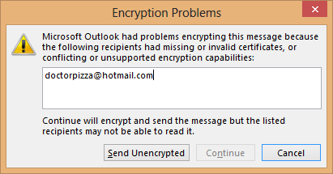


.. index::
   pair: GPG; Howto

.. _gpg_howto_1:

=====================================================
How to to encrypt e-mail, and why most don't bother
=====================================================

.. seealso:: http://arstechnica.com/security/2013/06/encrypted-e-mail-how-much-annoyance-will-you-tolerate-to-keep-the-nsa-away/

.. contents::
   :depth: 3

Introduction
=============

In an age of smartphones and social networking, e-mail may strike many as 
quaint. But it remains the vehicle that millions of people use every day to 
send racy love letters, confidential business plans, and other communications 
both sender and receiver want to keep private. 

Following last week's revelations (June 2013) of a secret program that gives 
the National Security Agency (NSA) access to some e-mails sent over Gmail, Hotmail, and 
other services—and years after it emerged that the NSA had gained access to 
full fiber-optic taps of raw Internet traffic—you may be wondering what you 
can do to keep your messages under wraps.

The answer is public key encryption, and we'll show you how to use it.

The uses of asymmetry
=====================

The full extent of the cooperation between the NSA and various technology 
ompanies is unclear. 

It will probably remain that way for the foreseeable future. 

For the time being, however, it seems likely that the standard cryptographic tools used to secure data "in flight"—that is to say, the SSL that protects data traveling between machines on the Internet—remain secure as long as certain best practices are used.

That protects against some threats, such as wholesale monitoring of Internet traffic of the kind the NSA is known to engage in, but it doesn't do anything to protect data that's "at rest." That is to say, SSL doesn't do anything to prevent a company like Google or Microsoft from handing over an archive of your e-mail in response to a court order. The e-mails are just lying around on some Google server somewhere.

If you don't want a government, service provider, employer, or unauthorized party to have access to your mail at rest, you need to encrypt the mail itself. But most encryption algorithms are symmetric, meaning that the encryption key serves a dual purpose: it both encrypts and decrypts. As such, people encrypting mail with a symmetric key would be able to decrypt other mail that used the same symmetric key. While this would protect against anyone without the key, it wouldn't be very useful as an encrypted e-mail system.

The solution to this is asymmetric cryptography. In asymmetric encryption there are two opposite keys, and a message encrypted with one key can only be decrypted with the other. The two keys are known as a private key, which as the name might suggest is kept private, and a public key, which is broadcast to the world. Each time you want to send an e-mail to someone, you encrypt it with the recipient's public key.

Asymmetric encryption is also used to perform mail signing. For this, the mail sender encrypts a hash, or mathematical fingerprint, of their file, producing a signature. Hashes are designed so that any small change to the message's text will produce a different hash value. Anyone reading the mail can then decrypt the signature using the sender's public key, giving them the original hash value. They can then compute the hash value of the mail they received and compare the two. If the values are the same, the message hasn't been modified. If they're not, it has—and we'll see the uses of this later on.

Making things even more complex, having encryption support isn't itself enough. To a great extent, you don't control the things that are in your own inbox. That's all mail that someone else has sent you. If you want your inbox to contain encrypted mail that only you can read, you need to be sure that people sending you mail are encrypting that mail when they send it. And if you want to be sure that everything in your sent mail folder is encrypted, you'll need to send other people encrypted mail.

As a result, e-mail encryption is not something you can impose unilaterally. To protect the contents of your account, you need to ensure that everyone you communicate with is in a position to handle encrypted mail—and is willing to use that ability.

Finally, e-mail encryption doesn't encrypt everything. Certain metadata—including e-mail addresses of both sender and recipient, time and date of sending, and the e-mail's subject line—is unencrypted. Only the body of the mail (and any attachments) gets protected.

If you're happy with these constraints, e-mail encryption is for you. Unfortunately, it can be complicated to use.
Cutting through the complexity

Few e-mail programs have PGP encryption features enabled by default. And even if they do, end users must still navigate a series of mazes that are long and confusing. Tasks include generating the key pair that will lock and unlock the communications and storing the private key in a location where no one else can get it. It also requires securely sharing a public key with every single person who wants to send you a private e-mail and securely getting a unique public key from each person you want to send encrypted e-mail to. No wonder most people—reportedly including Glenn Greenwald, the Guardian reporter who exposed aspects of the secret NSA dragnet—need time getting up to speed.

Fortunately, free e-mail encryption programs are available for all major operating systems, and the ability to use them effectively isn't out of the grasp of average computer users if they know where to look. What follows is a set of step-by-step instructions for using GnuPG, the open-source implementation of the PGP encryption suite, to send and receive encrypted e-mails on machines running Microsoft Windows and Mac OS X.

After that, we'll show readers how to use a similar crypto standard called S/MIME, which may prove simpler to deploy because it is already built into many desktop and mobile e-mail clients, including Outlook and Thunderbird. (Interested in S/MIME? Skip directly to page three.)

Linux will be touched on only briefly because much of the functionality is 
already included in various distributions and because many Linux users already 
have PGP down cold. 

Users are invited to provide Linux instructions and screenshots in the comments 
following this article

PGP on Windows
===============

    

The basic element you'll need to encrypt mail is software to generate and manage 
your key pair and make them work with whatever e-mail program you happen to use. 

On Windows, there's no shortage of proprietary apps that will do both, with 
Symantec's PGP Desktop E-mail being perhaps the best known. 

There's nothing wrong with this offering, but it's almost $200 for a single-user 
license. 

This tutorial will instead focus on the open-source Gnu Privacy Guard, which is 
available for free on Windows, Mac, and Linux platforms.

GnuPG, or simply GPG, is still available mostly as a command-line tool, meaning 
there's no graphical interface many end users would feel more comfortable using. 

Rather than learn a long list of GPG commands, many e-mail users are better off 
installing graphical implementation of GPG. 
On Windows, Gpg4win will give you everything you need to 
generate strongly encrypted messages that can be sent and later decrypted by 
the intended receiver using standard e-mail programs.

At time of writing, the most recent version of Gpg4win is 2.1.1 and it's available 
here. After downloading such a sensitive piece of software you'll want to confirm 
the installer hasn't been tampered with and truly came from Gpg4win rather than
a site masquerading as gpg4win.org. 
 
To do that, we'll need to check the SHA1 checksum for the downloaded file and 
make sure it matches the hash—a94b292c8944576e06fe8c697d5bb94e365cae25—listed 
on the Gpg4win download page. 
For those who prefer a graphical interface, use HashCalc. Install HashCalc and 
then open the program. In the "data" box, navigate to the folder where the 
downloaded gpg4win-2.1.1.exe file is located. In our case, since the SHA1 hash 
calculated by HashCalc matches the SHA1 digest provided on the Gpg4win download 
page, we have a high degree of confidence the file we're about to install is 
genuine.

For readers who prefer command lines, Microsoft's File Checksum Integrity 
Verifier may be a better way to check the SHA1 hashes. 

You'll need to download and extract the FCIV package and follow the instructions 
in the readme text file, including making sure the folder containing the FCIV 
executable file has been added to the system path of Windows. 

With that out of the way, open a Windows command window and navigate to the folder 
containing the Gpg4win installer.

Once you're sure you have the real gpg4win-2.1.1.exe, double-click on the file 
and click Yes to the User Access Control dialogue. 
When presented with the Gpg4win installation welcome screen, click Next, and 
then click Next at the following window to accept the Gpg4win license agreement. 

The next screen will allow you to choose the precise GPG components you want to 
install. Make sure you install all available components, including GPA, which 
is short for the GNU Privacy Assistant. Click Next at the Choose Components 
screen and again at the Destination and Install Options screens.

At the Install Options screen, makes sure the "start menu" box is checked, 
click Next, and at the next window click Install. We won't be using S/MIME 
for now, so if you see any screens referring to Trustable Root Certificates, 
you can click the box to skip configuration and click Next. 
The installation is now complete.

When you click on your Start menu and choose All Programs, you should now see 
a Gpg4win folder. Highlight it and choose GPA. This is the GNU Privacy Assistant. 
We'll use it to generate our key pair, and later we'll use it to store the 
public keys of people who will receive our encrypted messages. 
The first time you open GPA, you'll see a screen asking if you want to generate 
a private key. That's exactly what we want to do, so click "Generate key now."

In the screens that follow, enter your name and e-mail address. When asked if 
you want to back up your key, choose "Do it later." It's not that this step 
isn't important, but we'll want to back up the key only after we're satisfied 
that we've done everything correctly. Next, you'll need to choose a passphrase 
to protect your key. Your passphrase is like the password protecting an e-mail 
or Web account. Except rather than preventing an unauthorized person from 
accessing your account, it prevents the person from using your private key 
should it ever be lost or stolen. In other words, the password is extremely 
sensitive. It should have a minimum of nine characters, but 18, 27, or even 
36 characters are even better. 

For more tips on generating a strong password, see Ars Senior Reporter Jon Brodkin's 
discussion of master passwords here. When you're finished, you'll have generated 
your first key pair: the public key you will share with other people so they 
can send encrypted messages that only you can read, and the private key you'll 
use to decrypt those messages.

While generating your key, be sure to set an expiration date, rather than 
allowing it to remain valid forever. This way, keys that new users abandon, 
lose or never end up using won't remain on public servers indefinitely. 

Remember also to backup your private key somewhere that's extremely safe. 
**Storing it on a USB stick that's stored in lock box is one suitable method**. 

You may also want to upload your public key to one or more public key servers. 
These servers give crypto users a way to make their keys available to others 
and to fetch other people's public keys.

Now that we've generated our first key pair, let's import the public key of 
someone else so we'll have it later when we're ready to send them our first 
encrypted e-mail. For this, get someone to give you their public key, preferably 
in person. It will look something like this::

    -----BEGIN PGP PUBLIC KEY BLOCK-----
    Version: GnuPG v2.0.17 (MingW32)

    mQENBE/FhJ8BCADGhV//J7rdAKow2YlX2SwK5WtouAKnSncsw0gUc59zfMau95xA
    dCR/0zhZKUIVA9mvRthJ8YLnFQvaPyoiWq/rZJXRgA3ywA5Bi8aj/TJhHlTRRVIm
    llPMmaiKIrCJSG3oC7EXcGHK/ErfgnxIz/4ZGH4SEX9b7ERcjd5HVNgMizeKwNmJ
    ml5mUeKDd47H3uTeHkV9Ii5m7T2YHCklgtXtfPV0iIGAI48l3i3CUKiUYdOr96SM
    6hglvSI3zOLNOHBDWHO0eRN9g7WDyX2o3GhlXK8B9m631hcyPieqZ7sIKy8O1EYR
    u78j5ASB9rvGc07FBCScIpXhkAKbsUet06TTABEBAAG0J0RhbiBHb29kaW4gPGRh
    bi5nb29kaW5AYXJzdGVjaG5pY2EuY29tPokBOAQTAQIAIgUCT8WEnwIbAwYLCQgH
    AwIGFQgCCQoLBBYCAwECHgECF4AACgkQxc+lYXUQQmw9CggAn5n3zOtWZkGEYOP4
    IbTM0l10DEc0gucjFL0wfYqJXv6H7hi9j3K9zxCgBef6EIYRdWtAZScldfX9C1oD
    fwJIdSsPJecr3FJ6ia3O6CgilOMQo56kLMp2EzFMJSTog7jxd3MqANHclByVmwZe
    6xFvhy+6lCYufDVlNgIAPewOTxzmoXBXWlXHj6ozJhJWEFcBZNB699rhpp9/ZmSY
    IePpJJNhFM4pSpKToxZNSvULWC6UNamnPxx/fGEb1HHhf/W276sxny7TzL1P5PAM
    J2VrdQHbHPt4LFeTMu/T7j8rs0WYrwAnu2sBZuovPnXcK6JWvm5+k2FSHBCIlbD6
    F1zOCbkBDQRPxYSfAQgAyIsC4E4Jbry1SWfNzgUZ3KaXc/yHpKWvXK3iajj0l2gK
    BvxbIdWKd1S6Zu3rgLDLzTwWWhR5yMAh5GSXIzUOM8s2DxBDfKUwrYnJeK/AlQrS
    hIWEmM+38+q/i4Q65pTJnWkAPQmeoQk8j0DhmPaSPGYXZWFZh6i3ErNQ1IsdE2u4
    aNeNW2UZdmjRnK0ys01yrCwF4MC1Y+m74G0UHfpj2i0Esj0YeDR2wnYVMxjhLEkz
    SklKYm1j8Tv3CWGaYluQUtn1AGAA6wtM714pLn5DRKuvpu0p/jcY4GajFTTzB3Nj
    Kubd61OOvwZfIOw/MyEM3l1DfJSOhjgGwCzPEpGbzwARAQABiQEfBBgBAgAJBQJP
    xYSfAhsMAAoJEMXPpWF1EEJsBBMH/jexz65+EnSS49H1q3p8qoM5LygP9b8K2cI4
    1vPl3falThGV9EuQ3LifqXOg9BjyitYB09O+ARckzNd81j5kS9HFGJh3PaAbhHkn
    IUrCK46Rjz76zOkuunbInkc6Pbg4nHjl/wIHSFQXs7I+4khDJtBh0yFW5rV7yFIG
    v8zHSuZJqQ0FpwSJ19gBoBOtAVMKdJYvJRaw+JZcf2xqcYPOZIa/iCSe3LSVnIMV
    CXA28ZKQB10tZTm0y1V8fXXLuJd24+bN9hFr3fP1dj/w21EPQP1bCMGtNKCJ1DwR
    KTxdheirEBmS/0LO5nS561Y2UMQGhiK3Iku3RVCm7+qZLthAf7Q=
    =na8+
    -----END PGP PUBLIC KEY BLOCK-----

Take the public key of a real-world contact and save it to a file named 
something like key.txt. If you don't have a real-world contact who has a 
public key, save the above public key to a file and name it key.txt. 

Now, with GPA open, choose the "Import" icon, navigate to the disk location 
of key.txt, highlight the file, and click Open. Congratulations. 

You've just imported your first public key. Don't get too excited just yet. 
You'll need to import a public key for each person you want to send encrypted 
mail to.

Now what ?
==========

There are plenty of ways to receive someone's public key, but perhaps the 
easiest is in a simple text file. 

Once you have the .txt file of someone's public key, choose the Import button 
in GPA or GPGTools and select the file. 
If all goes according to plan, your key manager will now show two keys: the 
key pair you just generated and the public key you just imported. 
Keep in mind, however, that the integrity of any key exchange between you and 
a trusted party is crucial. 
If you mistakenly obtain Bob's public key when you wanted to obtain Alice's 
key, it will be impossible for Alice to read your message. Even worse, it will 
be trivial for Bob to decrypt your message. As a result, key exchanges should 
be done in person whenever possible, not over the phone, so each party can 
verbally confirm the fingerprint of the key being given to the other person. 

Remember, all the strong crypto in the world doesn't mean a thing if the public 
key in your possession doesn't belong to the person you think it does. 
The importance of this step can't be overstated.

Now that we have private and public keys, it's time to use them to send and 
receive e-mails that make use of them. 

To do that, we're going to use Enigmail, a plugin that gives the Mozilla 
Thunderbird e-mail program powerful encryption and cryptographic signing 
capabilities. 
Install Enigmail the way you'd install any Mozilla plugin. 
That is: right-click on this link, choose "save link as" and save the file to 
your desktop or some other location you'll remember. 
Then, with Thunderbird open, go to Tools and choose "add-ons." 
An add-ons Manager tab will open and will look like this:

  
   
Putting it to the test
=======================

OK, now it's time to send an encrypted e-mail. Prepare a new message the way 
you always do, by typing the address, subject, and body. 

The only requirement here is you must have the public key of the person 
you're e-mailing. Since we already imported the public key of a friend a 
little earlier, that's no problem. 

Now go to the OpenPGP menu and choose "Encrypt Message." 

You'll notice a check mark appears next to that selection, and you'll also see 
a key in the lower-right part of the message window turn amber. 

Click Send, read and click through the message boxes, and it's on its way. 

To anyone without the corresponding private key, the message will look like this:

   
   
Notice that everything other than the e-mail addresses and subject line are in 
ciphertext. 
But look what happens when we open the same message on a system that has Enigmail 
installed and the corresponding private key: First, we get prompted for the 
passphrase that we chose when we the generated the key pair. 
This password is what prevents an adversary from reading your email in the event 
that your private key is lost or stolen.

And when we type it in, voila! The ciphertext is converted to plaintext.

The ability of strong cryptography to protect sensitive communications from 
powerful adversaries is nothing short of a breakthrough. 

Unless the NSA knows of top-secret vulnerabilities civilian cryptographers 
don't know about, it would require government spies to expend vast amounts 
of time and resources factoring keys. 
Such an effort would have to be repeated for each separate key pair sending a 
message the spies want to read. 

At the same time, it's important to remember what GPG and PGP encryption does 
and doesn't do. 

Before people can send you an encrypted e-mail, they will have to receive a 
genuine copy of your public key. Before you can send them encrypted messages, 
you will have to receive a genuine copy of their key too. 
And if you want to send 100 people an encrypted e-mail, you'll have to have all 
100 of their public keys, too.

Still, e-mail encryption is effective when done right. 

It may not be something you plan to use when e-mailing your Aunt Gertrude, but 
it remains a valuable tool that's worth having in your chest.

S/MIME
======

PGP, as outlined in the prior pages, is one way of using public key crypto to 
encrypt e-mail. 

However, a number of e-mail clients, including Microsoft Outlook, 
Mozilla Thunderbird, and Apple Mail, have built-in support for another 
encryption system: S/MIME. 

The overall concept is quite similar, but it's the details that matter.

The two parts of the encryption key are stored separately. Operating systems 
and e-mail clients contain built-in storage for private keys. 

Public keys are distributed as certificates. A certificate includes a bunch of 
information describing who the certificate belongs to—for S/MIME purposes, this 
will typically be your name and e-mail address—along with the public key. 

These are all then cryptographically signed by the organization that issued 
the certificate, called a certificate authority.

Personal certificates for e-mail can be obtained for free from a bunch of 
certificate authorities, including StartCom and Comodo. 

These free certificates typically only include information about your e-mail 
address. If you want more information, such as your name or company, that will 
cost money. 
The process to sign up will vary from service to service, but essentially all 
of them ask for your name and e-mail address and then give you a certificate 
that's installed into your browser. 
The certificate may be sent instantly, or it might take a few hours for manual 
validation to be performed.

Generally, the certificates are installed directly into the certificate store 
your browser uses. If you use Chrome or Internet Explorer, that should be fine, 
as on Windows, they install certificates into the built-in Windows certificate 
store automatically. 
The Windows certificate store can be viewed by running certmgr.msc. 

Firefox has its own certificate storage, which can be viewed from its preferences 
dialog. 
Go to the Encryption tab of the Advanced page of the options dialog, and then 
click View Certificates to see them. 

If you're using OS X, we published instructions in 2011 that should hold more 
or less true today.

What you do at this point depends on which combination of browser and e-mail 
client you intend to use. 

If both your browser and mail program use the system certificate store, you're 
all set to proceed. 
If, however, you intend to use Firefox or Thunderbird, you'll annoyingly have 
to move the certificate and private key around. 
Not only do those applications not use the system certificate store, they also 
don't even share a common store between them.

To get the certificate out of Firefox, you'll need to go to Firefox's 
certificate view, as described above, select the certificate you want 
(you should find it in the "Your Certificates" section), click Backup, and 
follow the instructions. 
This will save the certificate and private key into a file.

To get the certificate out of the system certificate store, open up the Windows 
certificate manager, also as described above, select the certificate you want 
(this time it should be in "Personal\Certificates"), right-click it, and choose 
All Tasks > Export. 

Most of the wizard's default options should be fine, but make sure that you 
choose the "export private key" option. This is not the default.

At this point you'll have a file containing the certificate and private key.

To import the certificate into the system store so that it can be used in a 
program such as Outlook, navigate to Personal\Certificates in the system 
certificate manager. 
Right-click an empty spot and choose All Tasks > Import. Point the wizard at 
the file you saved earlier.

To use the certificate in Thunderbird
=====================================

To use the certificate in Thunderbird, visit Thunderbird's counterpart to the 
Firefox certificate manager (it's in the same place in the user interface, 
though the dialog boxes look slightly different). Import the saved file.

As far as the setup and configuration goes, that's about the extent of what 
needs doing. The process is straightforward enough, if a bit annoying in places. 

The next step is to actually use certificates to sign and encrypt e-mail. 

That's where things get more annoying.

Sending an encrypted e-mail is, in principle, straightforward enough. 

In Outlook, there's a button on the ribbon to enable encryption for an individual 
message, and if you want to encrypt by default, you can do so in 
File > Options > Trust Center > Trust Center Settings > E-Mail Security. 

Thunderbird similarly has a security button on its toolbar for one-off encryption, 
and it allows encryption to be enabled by default with 
Options > Account Settings > Security.

That's all great, but to send someone encrypted mail, as mentioned, it's not 
enough to have your own certificate (though you do need that too). 
You also need their certificate. If you try to send an encrypted message to 
someone whose certificate you don't have, you'll get a nice error message instead.

   

   
   
The usual way this is handled is to get your intended recipient to first send 
you a mail that's signed but not encrypted. Your mail client will notice the 
certificate on that mail and plumb it in appropriately so that you can 
subsequently send encrypted mail to that person.

This introduces some level of risk: is the signed mail you've received really 
from the person it purports to be from? Certificate authorities are supposed to 
provide the level of trustworthiness here. 

For the free certificates, which only include e-mail addresses rather than full 
identities, this isn't really much to go on. 

For paid certificates, which are in principle verified by the certificate 
authority, it is a slightly stronger guarantee. In either case, to be sure of 
the authenticity of a certificate, it's best to confirm it through some 
alternative channel (ideally in person).

Once they've done this, the process is all quite transparent. 

Encrypted mails will be decrypted automatically, provided that they were sent 
using the right certificates and haven't been tampered with. 
If the e-mail is sent with the wrong certificate, it will be unreadable.

In practice, using encrypted e-mail is awkward and annoying. 

Though S/MIME has been around for a long time and support is widespread both in 
desktop and mobile clients, its actual usage is rare. 

The same is true of PGP mail. PGP mail has essentially the same user experience 
and security features, just with less integration and less convenience. 

Its major virtue compared to S/MIME is that it doesn't depend on certificate 
authorities. This eliminates one source of costs (no need to buy certificates) 
and protects against a certificate authority being compromised by hackers or 
government forces.

The long and the short of it is that e-mail isn't a very good system for secure 
communications. 
You're wholly dependent on other people doing the right thing and sending you 
properly encrypted mail. While conscientious correspondents who know what 
they're doing might be willing to do this, most people won't. 

Moreover, the all-too-common not-quite-spam that many of us receive on a 
regular basis—mailing lists, shopping receipts, bill notifications, and 
so on—won't ever send encrypted mail. They're simply not built to do so.

The process is also error-prone. 
Since making encryption the default is in most cases impractical, most users of 
encrypted mail will be better served by encrypting only sensitive communications. 

This, however, carries with it the risk that they might forget to click 
the button. One solution might be to create a dedicated account only for 
encrypted communication (so that account could be configured to encrypt by 
default). 
But as you might have guessed, this just ramps up the inconvenience.

   

   
