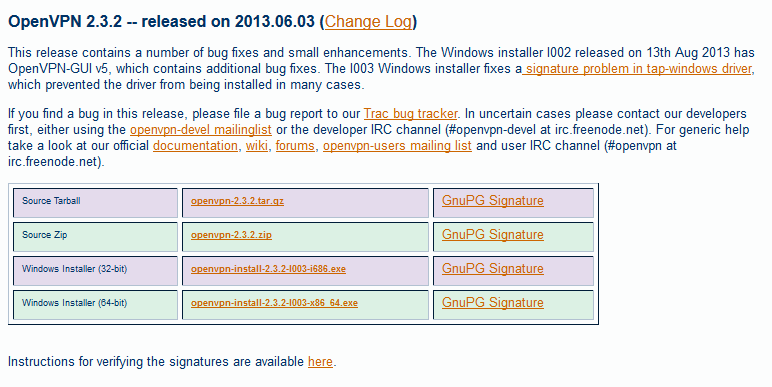


.. index::
   pair: Signature Electronique ; OpenVPN

.. _signature_electronique_openvpn:

================================================
Signature électronique du logiciel OpenVPN
================================================

.. seealso::

   - http://openvpn.net/index.php/open-source/documentation/sig.html
   - :ref:`gnupg_sign`

.. contents::
   :depth: 3

OpenVpn GnuPG (**OpenPGP**) Public Key
=======================================

Starting with OpenVPN 1.5.0, all file releases were signed by James Yonan 
(OpenVPN project founder and maintainer). 

Later, when OpenVPN 2.3_alpha2 was released, the signer was changed to 
Samuli Seppänen, the community manager of OpenVPN Technologies, Inc. 

In addition Debian/RPM packages are signed with yet another key.

To verify the file signatures, you need to add the signer's public key to your 
trusted PGP/GnuPG keyring:

- `James Yonan's OpenPGP key <http://swupdate.openvpn.net/community/keys/james_public_key.asc>`_ (for 1.5.0 -> 2.3_alpha1,  
  key fingerprint C699 B264 0C6D 404E 6454 A9AD 1D0B 4996 1FBF 51F3)
- Samuli Seppänen's OpenPGP key (2.3_alpha2 and later, key fingerprint 0330 0E11 FED1 6F59 715F 9996 C29D 97ED 198D 22A3)
- Package signing key (key fingerprint 30EB F4E7 3CCE 63EE E124  DD27 8E6D A8B4 E158 C569)

Note that James Yonan's PGP/GnuPG public key is also available in the archives 
for all OpenVPN mailing lists (such as here_).

Signature verification can be performed by PGP or GnuPG once you have the 
correct key in your trusted keyring::

    gpg --import keyname.asc

    gpg -v --verify [.asc file]

Make sure you have the corresponding OpenVPN package in the same directory. 

GnuPG signature files for OpenVPN file releases are available on the download page.

.. _here: http://openvpn.net/index.php/open-source/documentation/sig.html

