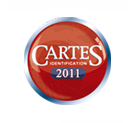


.. index::
   salons cartes (2011)

==================
Salon cartes 2011
==================

.. seealso::

   - http://www.cartes.com/Press/Exhibition-news/Find-out-who-won-the-2011-SESAMES-Awards

Infos générales
===============

NFC
---

Le sujet principal du salon a été le NFC. A l'horizon de 2 ans, tous les
téléphones mobiles seront NFC. Les premières applications  ciblées sont la
suppression du pass Navigo et le paiement type Moneo ou Carte Bleue par le
téléphone mobile.

Autres applications démontrées:

- location de voiture avec déverrouillage par téléphone NFC (site pilote
  organisé par le Grand Toulouse avec 5 Twingo)

Plus d'info sur NFC : voir article dans magazine "Electroniques".

VHBR
----

- Apparition des premiers lecteurs et cartes sans contact VHBR (débit 3.4MBits/s
  lecteur vers carte et 6.8MBits/s carte vers lecteur).

- Globalement, peu d'innovation au niveau matériel. Les valeurs ajoutées se
  développent autour des services et du web.

Compte-rendu technique
======================

Inside
------

Présentation d'une SIM avec antenne intégrée pour ajout de la fonction NFC dans
les téléphones mobiles non équipés.

Présentation de la première puce sécurisée sans contact VHBR.

NXP
---

Sortie officielle du CLRC663 successeur du CLRC632.

DUALI
-----

SIC9310 : chip reader 13,56MHz présenté comme compatible NXP CLRC ???

3M
--

Lecteur portable MD6000 : ISO7816 / ISO 14443 / Optical Fingerprint / OCR

AMS
---

AS3993
    nouveau chip UHF dédié low power / mobile

AS3911 : nouveau chip RF
    --> support du VHBR, 1W RF en sortie symétrique, fonction Squeltch, détection
    présence carte low power (5µA), compensation active d'adaptation d'antenne
    par capacité commutée.
    --> dispose d'une mesure de niveau RSSI --> peut être applicable à RYB si
    étude lecteur 15693 long range ? (fact sheet disponible à mon bureau).

VIRDI
-----

Capteur Optique OEM avec détection de Fake Finger.

XIRING
-------

OPA en cours d"INGENICO sur XIRING.

