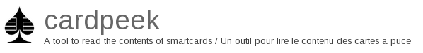


.. index::
   !cardpeek
   pair: Electronic/Biometric passports; cardpeek
   pair: ISO7816 smartcards ; cardpeek

.. _cardpeek:

=========
cardpeek
=========

.. contents::
   :depth: 3

En
==

Cardpeek is a Linux tool to read the contents of ISO7816 smartcards.
It features a GTK GUI to represent card data is a tree view, and is extendable
with a scripting language (LUA).

The goal of this project is to allow smartcard owners to be better informed
about what type of personnal information is stored in these devices.

The tool currently reads the contents of :

- EMV cards
- Navigo public transport cards (partially supports MOBIB as well)
- Moneo ePurse cards
- The French health card "Vitale 2"
- Electronic/Biometric passports in BAC security mode.

Latest source code tarball is here_.

More info on the Wiki here: http://code.google.com/p/cardpeek/wiki/Main

Fr
==

Cardpeek est un outil de lecture de carte à puce avec une interface graphique
basée sur GTK 2.0, fonctionnant sous GNU Linux et extensible par le langage de
programmation LUA.

Cardpeek est un outil qui a pour objectif de vous permettre d’accéder aux
informations personnelles qui sont stockées dans vos carte à puce.

Vous pouvez ainsi être mieux informé des données qui sont collectées sur vous.

Dans cette version, l’application est capable de lire le contenu des cartes suivantes:

- Les cartes à puce bancaires EMV
- Les cartes de transport d'île de France Navigo et certaines autres cartes
  similaires utilisée en France ou en Belgique (support MOBIB encore imparfait).
- Les cartes Monéo
- Les cartes Vitales 2
- Les passports électroniques/biométriques avec une sécurité BAC.

.. index::
   passeport
   EMV
   moneo
   carte vitale 2

smartcard structures
====================

- passeport:  https://code.google.com/p/cardpeek/source/browse/trunk/dot_cardpeek_dir/scripts/e-passport.lua
- emv: https://code.google.com/p/cardpeek/source/browse/trunk/dot_cardpeek_dir/scripts/emv.lua
- moneo  https://code.google.com/p/cardpeek/source/browse/trunk/dot_cardpeek_dir/scripts/moneo.lua
- carte vitale 2:  https://code.google.com/p/cardpeek/source/browse/trunk/dot_cardpeek_dir/scripts/vitale_2.lua

La dernière archive du code source est disponible ici_.

Plus de détails sur le Wiki : http://code.google.com/p/cardpeek/wiki/Main

.. _ici: http://cardpeek.googlecode.com/files/cardpeek-0.5.tar.gz
.. _here: http://cardpeek.googlecode.com/files/cardpeek-0.5.tar.gz

Versions
========

.. toctree::
   :maxdepth: 3

   versions/index

