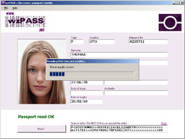
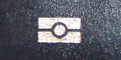
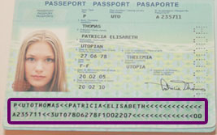

.. module:: wzpass 
   :synopsis: wzpass   

======
wzpass
======

Qu'est-ce que wzPASS ?
======================

wzPASS est un logiciel sous Windows capable de lire et d'afficher le contenu des 
Passeports Electroniques (ou Passeports Biométriques). 
Vous devez disposer d'un lecteur sans contact (PC/SC ou Pro-Active) pour utiliser wzPASS.

wzPASS est avant tout destiné aux personnes curieuses ,qui souhaitent savoir ce qu'il
y a exactement dans leur propre passeport. 
Néanmoins, wzPASS peut très facilement s'intégrer dans une borne de consultation 
en libre service, par exemple installée dans une mairie, pour que l'usager recevant
son nouveau passeport puisse en vérifier immédiatement le fonctionnement et le contenu.

wzPASS un logiciel libre (open source), qui s'appuie sur le composant logiciel wzMRTD.

Comment ça marche ?
===================

Spécifications internationales du passeport
-------------------------------------------

Un organisme international, l'ICAO (International Civil Aviation Organization)
a publié une spécification qui assure l'interopérabilité des Passeports 
Electroniques entre les différents pays émetteurs (le passeport électronique 
est officiellement nommé MRTD, pour « Machine Readable Travel Document »). 
Un grand nombre de pays délivrent désormais des passeports conformes à 
ce standard, qui sont identifiés par ce pictogramme sur la couverture:

Le pictogramme du Passeport Electronique

Lecture sans contact
--------------------

Le Passeport Electronique intègre une carte à puce sans contact. 
Le lecteur et la puce établissent une communication de proximité 
selon la norme ISO/IEC 14443 (porteuse à 13.56MHz, distance < 10cm).

wzPASS établit la communication avec la carte (le lecteur de proximité
n'est qu'un moyen de liaison «passif»), lit tout le contenu du passeport, 
et en affiche les éléments intéressants (identité et photo de face).

Authentication pour protéger l'intimité
---------------------------------------

L'accès aux Passeports Electronique est protégé par un système d'authentification
symétrique (BAC, "Basic Authentication") qui sert à interdire la lecture à 
l'insu du porteur(contrainte de respect de la vie privée). 

Pour pouvoir communiquer avec la puce électronique, il faut avoir le passeport
ouvert sous les yeux, afin d'y lire la clé d'authentification (cette clé se 
déduit de données numériques imprimées dans la «Machine Readable Zone» -MRZ).

La MRZ se situe en bas de la page principale du passeport

Les lecteurs de passeports utilisés au quotidien par les douaniers disposent 
d'un scanner avec système de reconnaissance optique des caractères (OCR). 

Ils peuvent ainsi lire automatiquement la MRZ pour effectuer l'authentification
nécessaire à la lecture de la puce. Ces équipements étant très onéreux, dans 
le cas de wzPASS nous saisirons manuellement la MRZ dans le logiciel.

Remerciements
-------------

* Sylvain Ferey pour son soutien régulier,
* Stanislas Dourdin qui a développé une première maquette opérationnelle,
* Damien Croisot qui a osé me préter son passeport,
* Oberthur Card System pour les passeports Utopiens,
* Pro-Active, mon fournisseur officiel pour tous les moyens techniques et pour le café.
    

Download
========  

Pré-requis
----------

wzPASS est une application Windows qui s'exécute dans le framework .NET v.2 . 
Vous devez télécharger et installer le runtime Microsoft .NET v.2 avant de 
pouvoir utiliser wzPASS.

Evidemment, pour lire votre passeport, vous aurez besoin d'un lecteur 
sans contact. wzPASS a été testé avec les lecteurs sans contact PC/SC 
de la marque OMNIKEY, et avec les lecteurs de chez Pro-Active.

Téléchargement
--------------

Veuillez lire et accepter le contrat de licence avant de télécharger ou d'installer wzPASS.

* `wzPASS v0.8 programme d'installation (EXE) <http://www.waazaa.org/download/wzpass_setup_0-8.exe>`_

Télécharger le code source
--------------------------

Le fichier ZIP ci-dessous contient l'ensemble du code source de wzPASS. 
Il s'agit d'un projet en langage C#, l'environnement de développement (IDE) 
utilisé est `Sharp Develop <http://www.icsharpcode.net/>`_ .

Le programme d'installation a été réalisé avec `Inno Setup <http://www.innosetup.com/>`_

Veuillez lire et accepter le `contrat de licence <http://www.waazaa.org/wzpass/license.php>`_ 
avant de télécharger ou d'installer wzPASS.

* `wzPASS v0.8 code source (ZIP) <http://www.waazaa.org/download/wzpass_0-8.zip>`_

Autres éléments disponibles

* Télécharger wzMRTD, le composant logiciel sur lequel wzPASS est construit.
* OpenJPEG est une implémentation open-source des codecs JPEG2000. 
  wzPASS l'utilise pour afficher les images encodées selon ce format. 
  J'ai compilé une DLL toute simple (j2ktobmp.dll) qui assure la conversion 
  JPEG2000 vers bitmap. 
  Vous pouvez télécharger le source `ici <http://www.waazaa.org/download/j2ktobmp.zip>`_ 
  (projet en C pour Microsoft Visual 6).

Retour d'expérience et support
------------------------------

Même si j'ai fait de mon mieux pour livrer un logiciel totalement opérationnel 
et non une version béta, il reste impossible de tester wzPASS avec tous les 
types de passeports en circulation, ni avec tous les lecteurs du marché.

Si vous rencontrez un problème dans wzPASS, et notamment une incompatibilité 
avec votre passeport, ou si vous souhaitez proposer une évolution du logiciel, 
n'hésitez pas à m'envoyer un e-mail.

Links
=====

- http://www.waazaa.org/wzpass/index.php
- http://www.waazaa.org/wzpass/download.php

