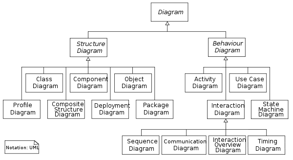

.. index::
   pair: Software Engineering ; UML
   ! UML

.. _uml:

===============================
UML (Unified Modeling Language)
===============================

.. seealso::

   - https://fr.wikipedia.org/wiki/Unified_Modeling_Language
   - https://en.wikipedia.org/wiki/Unified_Modeling_Language
   - http://fr.wikipedia.org/wiki/Comparaison_des_logiciels_d%27UML
   - :ref:`uml_diagrams`
   
   
.. figure:: Unified_Modeling_Language.jpg
   :align: center

Introduction
============

``UML`` (en anglais Unified Modeling Language ou ``langage de modélisation unifié``) 
est un langage de modélisation graphique à base de pictogrammes. 

Il est apparu dans le monde du génie logiciel, dans le cadre de la 
**conception orientée objet**. Couramment utilisé dans les projets logiciels, 
il peut être appliqué à toutes sortes de systèmes ne se limitant pas au domaine 
informatique.

UML est l'accomplissement de la fusion de précédents langages de modélisation 
objet : Booch, OMT, OOSE. Principalement issu des travaux de Grady Booch, 
James Rumbaugh et Ivar Jacobson, UML est à présent un standard défini par 
l'Object Management Group (OMG). 

La dernière version diffusée par l'OMG est UML 2.3 depuis mai 2010.
   

  
  
UML tools
==========

.. toctree::
   :maxdepth: 4

   tools/index

