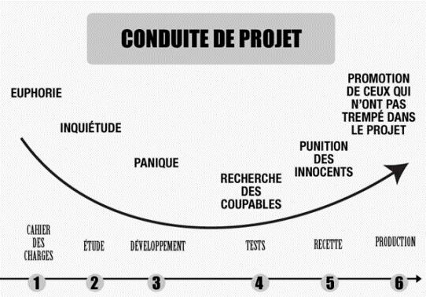

.. index::
   pair: Software engineering; Project management
   pair: Projet; Déroulement
   ! Projet

.. _project_management:

======================================
Project management
======================================

.. seealso::

   - http://en.wikipedia.org/wiki/Project_management
   - http://fr.wikipedia.org/wiki/Gestion_de_projet

.. contents::
   :depth: 3

   

Introduction
============

Project management is the discipline of planning, organizing, securing, and
managing resources to achieve specific goals.

A project is a temporary endeavor with a defined beginning and end
(usually time-constrained, and often constrained by funding or deliverables),
undertaken to meet unique goals and objectives, typically to bring about
beneficial change or added value.

The temporary nature of projects stands in contrast with business as usual
(or operations), which are repetitive, permanent, or semi-permanent
functional activities to produce products or services.

In practice, the management of these two systems is often quite different, and
as such requires the development of distinct technical skills and management
strategies.

The primary challenge of project management is to achieve all of the project
goals and objectives while honoring the preconceived constraints.

Typical constraints are scope, time, and budget.

The secondary—and more ambitious—challenge is to optimize the allocation and
integrate the inputs necessary to meet pre-defined objectives.

Modèle de gestion de projet 
============================

.. toctree::
   :maxdepth: 4

   modele/index

Project management tools
========================

.. toctree::
   :maxdepth: 4

   tools/index
