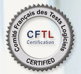

.. index::
   ! Comité français du test logiciel

.. _cftl:

================================
Comité français du test logiciel
================================

.. seealso::

   - https://fr.wikipedia.org/wiki/Comit%C3%A9_fran%C3%A7ais_du_test_logiciel
   - http://www.cftl.fr/

   

Présentation
=============

La qualité du logiciel est devenu un enjeu majeur de tout développement informatique. 

Si aujourd'hui des normes et des bonnes pratiques existent, elles ne sont pas 
toujours connues des testeurs, ni de leur encadrement

Depuis 2005, des experts en tests de logiciels en France se sont réunis au sein 
du Comité Français des Tests Logiciels (CFTL) pour développer, définir ou faire 
la promotion de contenus standards pour les formations en tests de logiciels, 
en ingénierie des exigences et pour promouvoir les échanges autour des bonnes 
pratiques dans ces deux domaines.

Ces formations sont certifiantes et reconnues internationalement, ce qui assure 
au testeur la reconnaissance de ses compétences, et aux sociétés qui les emploient 
la qualité des processus de tests qu’elles mettent en œuvre.

Le Comité Français des tests Logiciels représente en France l'International Software 
Testing Qualifications Board (ISTQB),  et le Requirements Engineering Qualification 
Board (REQB).

Ces organisations sont sans but lucratif, indépendantes et reconnues internationalement 
pour les compétences certifiées.

