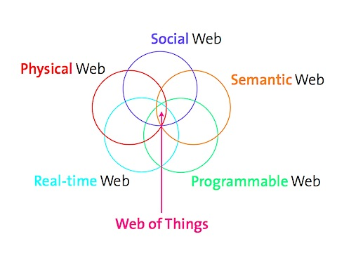


.. index::
   pair: Web ; of things
   pair: Web ; Les 5 web
   ! Internet of things
   ! IOT

.. _web_of_things:
.. _internet_of_things:

==============================================================
Internet of things (Web of things, #IoT, Internet des Objets)
==============================================================

.. seealso::

   - http://fr.wikipedia.org/wiki/Internet_des_objets
   - http://en.wikipedia.org/wiki/Internet_of_Things
   - http://www.webofthings.com/
   - http://www.internetactu.net/2011/02/22/de-linternet-des-objets-au-web-des-objets/
   - http://epcmashup.webofthings.com/

.. contents::
   :depth: 3

L'internet des objets
=====================

La promesse de l’internet des objets est de construire un réseau fluide d’appareils
hétérogènes connectés ensemble pour former un dispositif unique et cohérent.
Mais en fait, cette promesse est une escroquerie”, attaque, bille en tête, Vlad Trifa,
ingénieur à l’Institut d’informatique pervasive de l’Institut de technologie de
Zurich sur la scène de Lift à Genève.

Il existe déjà plus d’une quinzaine de protocoles techniques pour assurer les
communications domotiques et machines à machines (M2M), mais ceux-ci demeurent
largement inconnues des programmeurs qui ne sont pas spécialisés sur ces sujets.

Si l’industrie a construit des normes pour contrôler l’internet des objets, elle
est loin d’être parvenue à un accord. “La réalité aujourd’hui est que nous avons
plutôt construit des intranets pour un grand nombre de choses qu’un internet
des objets, chacun formant un îlot isolé de quelques appareils connectés qui
n’ont pratiquement aucun moyen d’interagir les uns avec les autres”.

L’internet des objets est donc une utopie.

About
=====

What is WebofThings.com ?
--------------------------

It is a web page founded by `Dominique Guinard and Vlad Trifa`_, two researchers/geeks
working at ETH Zurich and SAP Research Zurich. It is more a scrap book that is
here to dump our thoughts ideas on our research and work topic, which is the
Web of Things.

Unlike most Web 2.0 sites that are about advanced powerpoint engineering, we
talk about real things that’s under the hood.

.. _`Dominique Guinard and Vlad Trifa`:  http://www.webofthings.com/about/team

Projects
========

.. toctree::
   :maxdepth: 3
   
   projects/index

Tools
========

.. toctree::
   :maxdepth: 3
   
   tools/index   

   

