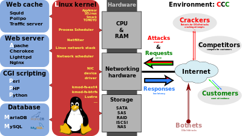
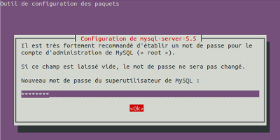
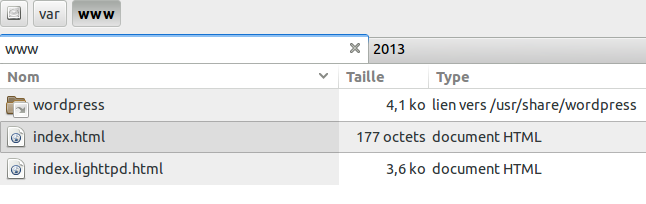
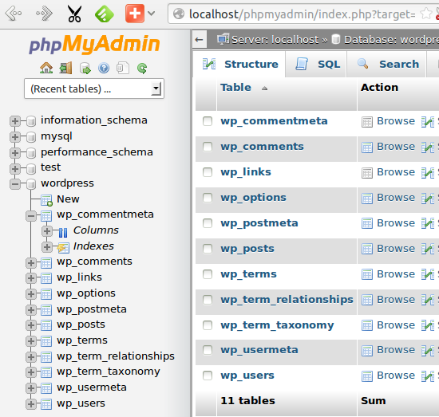
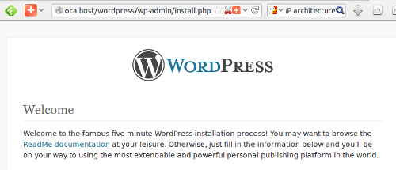
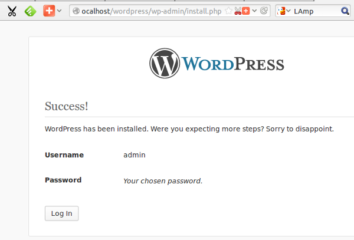
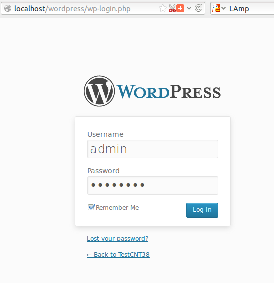


.. index::
   pair: mysql-server; Installation
   pair: Wordpress; Ubuntu

.. _wordpress_installation_ubuntu:

================================
Wordpress installation on Ubuntu
================================

.. seealso::

   - http://installer-wordpress.blogspot.fr/2012/04/installer-wordpress-sur-ubuntu.html
   - :ref:`lamp` 

.. contents::
   :depth: 3

.. _install_lamp:

Installer le framework LAMP =>(sudo tasksel install lamp-server)
==================================================================

.. seealso::

   - :ref:`lamp` 

::

    sudo tasksel install lamp-server

.. _mysqlserver_installation_ubuntu:

Installation de mysql-server 5.5
--------------------------------

.. seealso::

   - :ref:`mysql`

:utilisateur: root
:pwd:  g...

   
   
Installation de wordpress (sudo aptitude search wordpress)
===========================================================

::

    sudo aptitude search wordpress

::

    p   python-wordpresslib             - Python module to connect to Wordpress blog
    p   unity-webapps-wordpress         - Unity Webapp for wordpress                
    p   unity-webapps-wordpress-com     - Application Web Unity pour wordpress-com  
    p   wordpress                       - gestionnaire de blog                      
    p   wordpress-l10n                  - gestionnaire de blog - fichiers de langue 
    p   wordpress-openid                - Extension OpenID pour WordPress           
    p   wordpress-shibboleth            - Shibboleth plugin for WordPress           
    p   wordpress-xrds-simple           - Extension XRDS-simple pour WordPress     

sudo aptitude install wordpress
================================
 
::

    sudo aptitude install wordpress
  
::
  
    Les NOUVEAUX paquets suivants vont être installés :
    libjs-cropper{a} libjs-prototype{a} libjs-scriptaculous{a} 
    libphp-phpmailer{a} libphp-snoopy{a} php5-gd{a} tinymce{a} wordpress 
    wordpress-l10n{a} 
    0 paquets mis à jour, 9 nouvellement installés, 0 à enlever et 6 non mis à jour.
    Il est nécessaire de télécharger 13,6 Mo d'archives. 
    Après dépaquetage, 45,0 Mo seront utilisés.
    Voulez-vous continuer ? [Y/n/?] Y

::

    Prendre : 1 http://fr.archive.ubuntu.com/ubuntu/ saucy-updates/main php5-gd i386 5.5.3+dfsg-1ubuntu2.1 [32,9 kB]
    Prendre : 2 http://fr.archive.ubuntu.com/ubuntu/ saucy/universe libjs-prototype all 1.7.1-3 [44,2 kB]
    Prendre : 3 http://fr.archive.ubuntu.com/ubuntu/ saucy/universe libjs-scriptaculous all 1.9.0-2 [107 kB]
    Prendre : 4 http://fr.archive.ubuntu.com/ubuntu/ saucy/universe libjs-cropper all 1.2.2-1 [139 kB]
    Prendre : 5 http://fr.archive.ubuntu.com/ubuntu/ saucy/universe libphp-phpmailer all 5.1-1 [77,0 kB]
    Prendre : 6 http://fr.archive.ubuntu.com/ubuntu/ saucy/universe libphp-snoopy all 1.2.4-2 [17,6 kB]
    Prendre : 7 http://fr.archive.ubuntu.com/ubuntu/ saucy/universe tinymce all 3.4.8+dfsg0-1 [488 kB]
    Prendre : 8 http://fr.archive.ubuntu.com/ubuntu/ saucy/universe wordpress all 3.6.1+dfsg-1 [3 831 kB]
    Prendre : 9 http://fr.archive.ubuntu.com/ubuntu/ saucy/universe wordpress-l10n all 3.6.1+dfsg-1 [8 880 kB]
    13,6 Mo téléchargés en 50s (272 ko/s)                                           
    Sélection du paquet php5-gd précédemment désélectionné.
    (Lecture de la base de données... 1120353 fichiers et répertoires déjà installés.)
    Dépaquetage de php5-gd (à partir de .../php5-gd_5.5.3+dfsg-1ubuntu2.1_i386.deb) ...
    Sélection du paquet libjs-prototype précédemment désélectionné.
    Dépaquetage de libjs-prototype (à partir de .../libjs-prototype_1.7.1-3_all.deb) ...
    Sélection du paquet libjs-scriptaculous précédemment désélectionné.
    Dépaquetage de libjs-scriptaculous (à partir de .../libjs-scriptaculous_1.9.0-2_all.deb) ...
    Sélection du paquet libjs-cropper précédemment désélectionné.
    Dépaquetage de libjs-cropper (à partir de .../libjs-cropper_1.2.2-1_all.deb) ...
    Sélection du paquet libphp-phpmailer précédemment désélectionné.
    Dépaquetage de libphp-phpmailer (à partir de .../libphp-phpmailer_5.1-1_all.deb) ...
    Sélection du paquet libphp-snoopy précédemment désélectionné.
    Dépaquetage de libphp-snoopy (à partir de .../libphp-snoopy_1.2.4-2_all.deb) ...
    Sélection du paquet tinymce précédemment désélectionné.
    Dépaquetage de tinymce (à partir de .../tinymce_3.4.8+dfsg0-1_all.deb) ...
    Sélection du paquet wordpress précédemment désélectionné.
    Dépaquetage de wordpress (à partir de .../wordpress_3.6.1+dfsg-1_all.deb) ...
    Sélection du paquet wordpress-l10n précédemment désélectionné.
    Dépaquetage de wordpress-l10n (à partir de .../wordpress-l10n_3.6.1+dfsg-1_all.deb) ...
    Traitement des actions différées (« triggers ») pour « libapache2-mod-php5 »...
    Traitement des actions différées (« triggers ») pour « man-db »...
    Paramétrage de php5-gd (5.5.3+dfsg-1ubuntu2.1) ...

    Creating config file /etc/php5/mods-available/gd.ini with new version
    php5_invoke: Enable module gd for cli SAPI
    php5_invoke: Enable module gd for apache2 SAPI
    Paramétrage de libjs-prototype (1.7.1-3) ...
    Paramétrage de libjs-scriptaculous (1.9.0-2) ...
    Paramétrage de libjs-cropper (1.2.2-1) ...
    Paramétrage de libphp-phpmailer (5.1-1) ...
    Paramétrage de libphp-snoopy (1.2.4-2) ...
    Paramétrage de tinymce (3.4.8+dfsg0-1) ...
    Traitement des actions différées (« triggers ») pour « libapache2-mod-php5 »...
    Paramétrage de wordpress (3.6.1+dfsg-1) ...
    Added to /var/lib/wordpress/wp-content/themes: index.php twentythirteen twentytwelve 
    Added to /var/lib/wordpress/wp-content/plugins: akismet index.php 
    Added to /var/lib/wordpress/wp-content/languages: admin-ar.mo admin-bs_BA.mo admin-ca.mo admin-cy.mo admin-da_DK.mo admin-de_DE.mo admin-es_ES.mo admin-et.mo admin-eu.mo admin-fa_IR.mo admin-fr_FR.mo admin-gl_ES.mo admin-he_IL.mo admin-hr.mo admin-it_IT.mo admin-ja.mo admin-ko_KR.mo admin-my_MM.mo admin-network-ar.mo admin-network-bs_BA.mo admin-network-ca.mo admin-network-cy.mo admin-network-da_DK.mo admin-network-de_DE.mo admin-network-es_ES.mo admin-network-et.mo admin-network-fa_IR.mo admin-network-fr_FR.mo admin-network-gl_ES.mo admin-network-he_IL.mo admin-network-hr.mo admin-network-it_IT.mo admin-network-ja.mo admin-network-ko_KR.mo admin-network-my_MM.mo admin-network-ru_RU.mo admin-network-sk_SK.mo admin-network-sl_SI.mo admin-network-sq.mo admin-network-sr_RS.mo admin-network-sv_SE.mo admin-network-ug_CN.mo admin-network-zh_CN.mo admin-ru_RU.mo admin-sk_SK.mo admin-sl_SI.mo admin-sq.mo admin-sr_RS.mo admin-sv_SE.mo admin-ug_CN.mo admin-zh_CN.mo ar.mo bg_BG.mo bn_BD.mo bs_BA.mo ca.mo ckb.mo continents-cities-bg_BG.mo continents-cities-bs_BA.mo continents-cities-cs_CZ.mo continents-cities-da_DK.mo continents-cities-de_DE.mo continents-cities-en_CA.mo continents-cities-et.mo continents-cities-eu.mo continents-cities-fa_IR.mo continents-cities-fr_FR.mo continents-cities-gd.mo continents-cities-he_IL.mo continents-cities-hr.mo continents-cities-hu_HU.mo continents-cities-it_IT.mo continents-cities-ja.mo continents-cities-ka_GE.mo continents-cities-ko_KR.mo continents-cities-lv.mo continents-cities-my_MM.mo continents-cities-pt_PT.mo continents-cities-ro_RO.mo continents-cities-ru_RU.mo continents-cities-sk_SK.mo continents-cities-sl_SI.mo continents-cities-sq.mo continents-cities-sr_RS.mo continents-cities-su_ID.mo continents-cities-sv_SE.mo continents-cities-ug_CN.mo continents-cities-zh_CN.mo cs_CZ.mo cy.mo da_DK.mo de_DE.mo en_CA.mo eo.mo es_CL.mo es_ES.mo es_PE.mo et.mo eu.mo fa_IR.mo fi.mo fr_FR.mo gd.mo gl_ES.mo he_IL.mo hr.mo hu_HU.mo id_ID.mo it_IT.mo ja.mo jv_ID.mo ka_GE.mo ko_KR.mo lv.mo mk_MK.mo ms_MY.mo my_MM.mo nb_NO.mo nl_NL.mo pl_PL.mo pt_BR.mo pt_PT.mo ro_RO.mo ru_RU.mo ru_UA.mo si_LK.mo sk_SK.mo sl_SI.mo sq.mo sr_RS.mo su_ID.mo sv_SE.mo sw.mo ta_LK.mo th.mo tr_TR.mo ug_CN.mo uk.mo ur.mo zh_CN.mo zh_HK.mo zh_TW.mo 
    Paramétrage de wordpress-l10n (3.6.1+dfsg-1) ...
 
 
       
       
Lien pour le serveur web Apache2 //var/www/wordpress
=====================================================

Ensuite, créez un lien symbolique de votre répertoire d'installation wordpress
vers le répertoire d’Apache2 ( 

::

    sudo ln -s /usr/share/wordpress /var/www/wordpress

          

Création de la base de données "wordpress"
==========================================

Installer une nouvelle base de donnée MySQL  nommée ``wordpress`` en local (localhost).

::

    sudo bash /usr/share/doc/wordpress/examples/setup-mysql -n wordpress localhost

 
::

    @vercors:/usr/share/doc/wordpress/examples$ sudo bash /usr/share/doc/wordpress/examples/setup-mysql -n wordpress localhost
    PING vercors (127.0.0.1) 56(84) bytes of data.
    64 bytes from vercors (127.0.0.1): icmp_seq=1 ttl=64 time=0.020 ms
    1 packets transmitted, 1 received, 0% packet loss, time 0ms
    rtt min/avg/max/mdev = 0.020/0.020/0.020/0.000 ms
    /etc/wordpress/config-localhost.php written
    Trying to create wp-content directory: /srv/www/wp-content/localhost
    Setting up permissions
    Goto http://localhost to setup Wordpress

      

Si vous connaissez déjà l’url de votre hôte virtuel pour installer Wordpress, 
utilisez-la au lieu de localhost.  

Par exemple, si votre url est x.homeserve.org, alors la commande doit être::

    sudo bash /usr/share/doc/wordpress/examples/setup-mysql -n wordpress mysite_x.homeserve.org

Si vous accédez à votre serveur de Wordpress à travers un hôte virtuel, créez
votre fichier de configuration pour l’hôte virtuel dans un répertoire disponible 
de /etc/apache2/sites-available. 

Une fois que vous avez modifié le fichier, créez un lien symbolique de ce 
répertoire vers the /etc/apache2/sites-enabled. 

Redémarrez apache2::
 
    sudo /etc/init.d/apache2 restart

Aller sur http://localhost/wordpress 
====================================

Ensuite, installez Wordpress avec le navigateur comme dans une installation 
classique en utilisant l’adresse::

    http://localhost/wordpress
        

    
    

Ou si vous utilisez un hôte virtuel::

    http:/mysite_x.homeserve.org/wordpress

 
Pour que la mise à jour automatique fonctionne quand vous installez Wordpress 
sur Ubuntu, tous les fichiers, répertoires et sous-répertoires doivent 
appartenir à www-data qui est aussi le propriétaire du processus apache2::

    sudo chown -R www-data /usr/share/wordpress 

Installation de Wordpress avec Firefox
=======================================

      
   
   
Login sur le site local
=======================

:user:  admin

.. gn..

   
   
   

