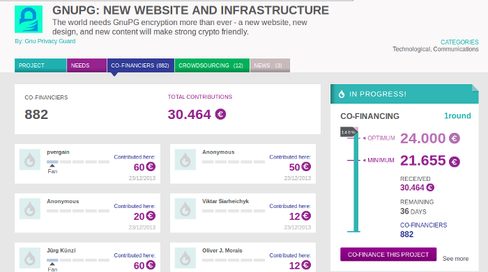


.. index::
   pair: GNUPG; Goteo

.. _goteo_gnupg:

============
Goteo GNUPG
============

.. seealso::

   - http://goteo.org/project/gnupg-new-website-and-infrastructure
   

Dear pvergain,

Thank you very much for co-financing the GnuPG: new website and infrastructure 
project in the amount of 60 €.

We remind you that you have chosen the following reward, as described in the 
project's page: An @GnuPG.net address

Important: This reward will be effective considering its period of production, 
and only if it obtains the minimum funding required.

We'd also like to take advantage of this correspondence to give you some details 
about how bank transactions work.

As you will have seen when it came to choosing a form of payment, there are two 
possible methods: PayPal and credit card.

If you chose PayPal, the charge will not be made until the end of the first 
round of financing for the project (40 days) and only if the project has 
received the minimum budget required. 
This process is a preauthorization to collect the amount you decided only if 
those conditions are fulfilled. You might say it's a commitment to pay as long 
as the project gets enough support (or promises of support) :-)

If you used a credit card, the process is different: the charge is made 
immediately to the corresponding account, and at the end of the first round 
of financing, if the project that you have supported does not achieve its 
minimum financing, your contribution is refunded (at no additional cost) 
to the same account used in the original transaction.

Have a good day!

The Goteo Mailer

http://goteo.org/
Collective financing with open DNA
Crowdfunding the Commons

::

    hola@goteo.org
    twitter/identica: @goteofunding
    Goteo is a social network for crowdfunding and distributed collaboration (services, infrastructures, microtasks and other resources) for encouraging the independent development of creative and innovative initiatives that contribute to the common good, free knowledge, and open code.
    www.goteo.org
    Discover projects
    Create a project
    Síguenos en:
    facebook | twitter | RSS
    If you don't want to receive more updates form Goteo.org, you can unsubscribe your email address with link
    An initiative of: Platoniq   

