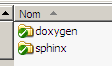

.. index::
   Doxygen (integrate in sphinx)

.. _integrate_doxygen_documentation_in_sphinx:

==========================================
integrate doxygen documentation in sphinx
==========================================

**There is an easy way to include Doxygen information in a set of documentation
generated by Sphinx**.

Create 2 directories for sphinx and doxygen
===========================================

   *Directories for sphinx and doxygen*

Copy the doxygen output files in _build/html/_downloads directory
==================================================================

copy_doxygen_doc.bat
--------------------

:download:`Télécharger le fichier de commandes DOS <copy_doxygen_doc.bat>`

.. literalinclude:: copy_doxygen_doc.bat

Copy with python shutil.rmtree and shutil.copytree
--------------------------------------------------

:download:`Télécharger le fichier python <copytree_doxygen.py>`

.. literalinclude:: copytree_doxygen.py

Download the index.html source file from sphinx documents
===============================================================

First sphinx document
---------------------

::

    Le but de la bibliothèque logicielle est de proposer une API C permettant la
    communication entre:

    - l'application :term:`EUCLIDE`
    - un ensemble de 40 :term:`boîtiers`
    - un :term:`lecteur de cartes à puces` (RFID)
    - une :term:`clé RF`

    :download:`Télécharger  la documentation doxygen du projet CR_Euclide <../doxygen/html/index.html>`.

Second sphinx document
----------------------

::

    .. _doxygen_documentation:

    =======================
    Doxygen Documentation
    =======================

    :download:`Télécharger  la documentation doxygen du projet CR_Euclide <../../../doxygen/html/index.html>`.

Tree docs directory
====================

::

    +---doxygen
    |   |   TagFile.xml
    |   |
    |   +---def
    |   |       doxygen.def
    |   |
    |   \---html
    |       |   annotated.html
    |       |   bc_s.png
    |       |   classes.html
    |       |   class_ryb_eliot_1_1_antennas-members.html
    |       |   _write_tag_form_8cs_source.html
    |       |   _write_tag_form_8_designer_8cs.html
    |       |   _write_tag_form_8_designer_8cs_source.html
    |       |
    |
    \---sphinx
        |   index.rst
        |   make.bat
        |   Makefile
        |
        |
        +---_build
        |   \---html
        |       +---_downloads
        |       |   |   annotated.html
        |       |   |   bc_s.png
        |       |   |   classes.html
        |       |   |
        |       |   \---search
        |       |           all_5f.html
        |       |           all_61.html
        |
        +---_static
        \---_templates

