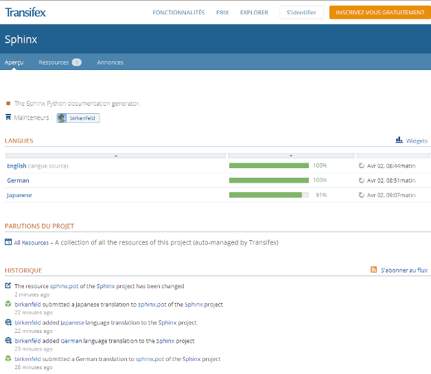

.. index::
   pair: Sphinx ; Translations
   pair: Sphinx; Transifex

.. _sphinx_translations:

=======================
Sphinx translations
=======================

.. seealso::

   - https://www.transifex.com/projects/p/sphinx-1/

Announce
=========

::

    Georg Brandl <georg@python.org>
    répondre à:  sphinx-users@googlegroups.com
    à:   sphinx-users@googlegroups.com
    date:    2 avril 2013 11:00
    objet:   [sphinx-users] Re: Call for translation updates - Now on transifex

Hi,

since editing raw .po files is not a good workflow for everyone, I registered
Sphinx on Transifex:

   https://www.transifex.com/projects/p/sphinx-1/

If you want to translate/update to your language there, please drop me an
email and I will add you to the corresponding language group.

cheers,
Georg

::

    On 04/01/2013 12:26 PM, Georg Brandl wrote:
    > Hi all,
    >
    > for the pending 1.2 release I'd like to update as many locales as possible.
    > If you speak one of the languages that Sphinx supports and can spare the
    > time, it would be great if you could look over the message catalog
    > (sphinx.po) in your language at
    > https://bitbucket.org/birkenfeld/sphinx/src/tip/sphinx/locale and open an
    > issue/pull request with the necessary update or the new file.
    >
    > Thanks, Georg
    >
