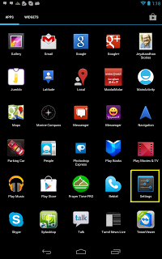
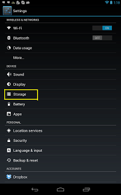
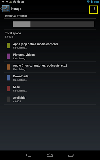
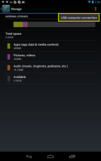
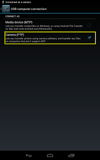

================
Settings camera
================

.. seealso:: http://zacktutorials.blogspot.ca/2012/08/nexus7-android-development.html

.. contents::
   :depth: 3
   

Click on the settings in the APPS menu page (See the highlighted settings)
==========================================================================

   
 
Click on the Device - Storage as highlighted below
===================================================
   

   
   
Click on the view more options in the storage as highlighted in yellow below
============================================================================
   

   
Click on the USB Computer connection
=====================================
   

   
   
Select the option Camera(PTP) option
=====================================    

Your android device can be deducted only if this mode is selected.

Don't choose the option Media device (MTP) which is highly supported in 
Mac OS.

   
               
