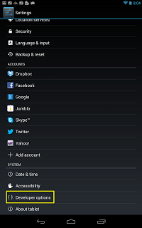
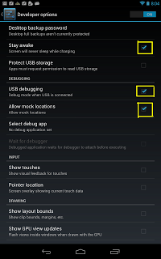

======================
Settings developper
======================   
   
   
.. seealso:: http://zacktutorials.blogspot.ca/2012/08/nexus7-android-development.html

.. contents::
   :depth: 3
  

Developper settings
===================

.. seealso:: http://www.androidcentral.com/how-enable-developer-settings-android-42

A few months from now, this will seem funny. But for a little while, for 
a few scary hours, we had no developer settings on the Nexus 4. Ponder 
that for a moment. A Nexus device with no developer settings. 

Actually, it wasn't quite that bad. A little hackery, and we had a direct 
shortcut to the dev settings. 

But there's an easier way to enable the developer settings on Android 4.2. 
Oh, they're still on the phone, so nobody freak out. Google hasn't taken 
the "developer" out of its Nexus line, and it's not going to anytime soon. 
But the settings have been hidden from casual view in the settings menu. 

**Here's how to get them back**:

- Go to the settings menu, and scroll down to "About phone." Tap it.
- Scroll down to the bottom again, where you see "Build number." 
  (Your build number may vary from ours here.)
- Tap it **seven (7)** times. After the **third** tap, you'll see a playful 
  dialog that says you're four taps away from being a developer. 
  (If only it were that simple, eh?) 
  Keep on tapping, and *poof*, **you've got the developer settings back**.

   

Select Developer Options
=========================

   
Select the following options
============================

- Stay awake
- USB debugging
- Allow mock locations

