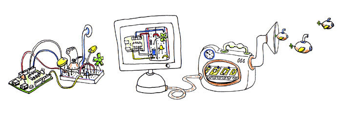

.. index::
   fritzing

=========
Fritzing
=========

.. seealso::

   - http://fritzing.org/
   - https://twitter.com/#!/FritzingOrg

About Fritzing
===============

.. seealso:: http://hackaday.com/2012/05/10/going-from-idea-to-schematic-to-printed-pcb/

Fritzing is an open-source initiative to support designers, artists, researchers
and hobbyists to work creatively with interactive electronics.

We are creating a software and website in the spirit of Processing_ and Arduino_,
developing a tool that allows users to document their prototypes, share them
with others, teach electronics in a classroom, and to create a pcb layout for
professional manufacturing.

.. _Processing: http://processing.org/
.. _Arduino: http://arduino.cc/

