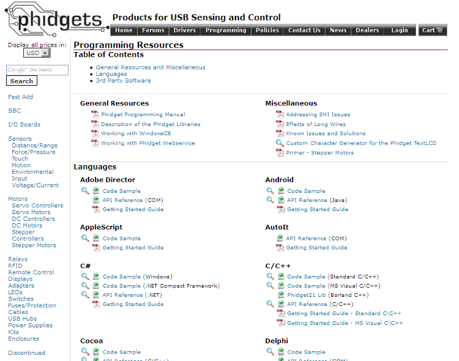
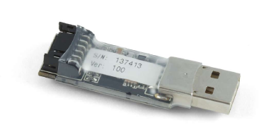

.. index::
   ! Sensors (interfaces phidgets)

.. _sensors_interfaces_phidgets:

==================
Sensors interfaces
==================

.. seealso::

   - http://www.phidgets.com
   - http://www.phidgets.com/programming_resources.php

The PhidgetInterfaceKit **2/2/2** allows you to connect devices to any of:

- **2 analog inputs**
- **2 digital inputs**
- **2 digital outputs**

It provides a generic, convenient way to interface your PC with various devices.
The USB dongle form factor dramatically reduces the space required to add
interfacing capability to your project.

Analog inputs
=============

Analog Inputs are used to measure continuous quantities, such as temperature,
humidity, position, pressure, etc.

Phidgets offers a wide variety of sensors that can be plugged directly into the
board using the cable included with the sensor.

Here is a list of sensors currently available

.. hlist::
   :columns: 3

   - IR Distance Sensor
   - IR Reflective Sensor
   - Vibration Sensor
   - Light Sensor
   - Force Sensor
   - Humidity Sensor
   - Temperature Sensor
   - Magnetic Sensor
   - Rotation Sensor
   - Voltage Divider
   - Touch Sensor
   - Motion Sensor
   - Mini Joy-Stick Pressure Sensor
   - Voltage Sensor
   - Current Sensor
   - Slide Sensor
   - Sound Sensor

Each analog input can be adjusted to sample at a data rate ranging from 1 sample
to up to 1000 samples per second. Samples are transmitted to your PC every 8ms.

This feature is very useful for setting up the resolution of your data logging.
Note that data rate is limited to 16ms when opening over the Phidget Webservice

Architecture
============

We have designed our libraries to give you the maximum amount of freedom. We do
not impose our own programming model on you.

To achieve this goal we have implemented the libraries as a series of layers
with the C API at the core surrounded by other language wrappers.

Libraries
----------

The lowest level library is the C API. The C API can be programmed against on
Windows, CE, OS X and Linux. With the C API, C/C++, you can write cross-platform
code. For systems with minimal resources (small computers), the C API may be the
only choice.

The Java API is built into the C API Library.
Java, by default is cross-platform - but your particular platform may not support
it (CE).

The .NET API also relies on the C API. Our default .NET API is for .NET 2.0
Framework, but we also have .NET libraries for .NET 1.1 and .NET Compact
Framework (CE).

The COM API relies on the C API. The COM API is programmed against when coding
in VB6, VBScript, Excel (VBA), Delphi and Labview.

The ActionScript 3.0 Library relies on a communication link with a
PhidgetWebService (see below). ActionScript 3.0 is used in Flex and Flash 9.

