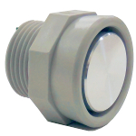

.. index::
   ! ultrasonic telemeter

.. _ultrasonic_telemeter_max_sonar_mb7077:

=======================================
Ultrasonic telemeter MAXSonar (MB7077)
=======================================

.. seealso::

   - http://www.maxbotix.com/products/MB7077.htm
   - http://fr.wikipedia.org/wiki/T%C3%A9l%C3%A9m%C3%A8tre
   - http://fr.wikipedia.org/wiki/%C3%89cholocation

:download:`Télécharger la datasheet du XL-MaxSonar <MB7067-MB7077_Datasheet.pdf>`.

Component Overview
==================

- 42kHz Ultrasonic sensor measures distance to objects
- RoHS Compliant
- Read from all 3 select sensor outputs: Analog Voltage, Serial, Pulse Width
- Possible dead zone 0-4 cm, objects closer than 20 cm range as 20 cm
- Resolution of 1 cm
- Operates from 3.0-5.5V
- Low 3.4mA average current requirement
- 10Hz reading rate
- Small, light weight module
- Designed for easy integration into your project or product
- Operational Temperature from -40˚C to +70˚C (-40˚F to +160˚F)
- Real-time automatic calibration (voltage, humidity, ambient noise)
- Firmware filtering for better noise tolerance and clutter rejection
- 200,000+ Hours Mean Time Between Failure
- Weather Resistant (IP67), optional Chemical Resistant F-Option
- Matches standard electrical 3/4-inch PVC pipe fittings for easy mounting
  (3/4" National Pipe Thread Straight)
- Compact version of our most popular outdoor rangefinder
- Maximum reported range of 765 cm (300 inches)
- Maximum range to most targets of 645cm (254 inches)
- Long range, narrow detection zone

The MB7067 and MB7077 sensors provide very short to long-range detection and
ranging, in an extra compact, robust PVC housing, designed to meet **IP67 water
intrusion**, and matches standard electrical ¾ PCV pipe fittings.

This sensor has a new high power output along with real-time auto calibration
for changing conditions (temperature, voltage or acoustic or electrical noise)
that ensure you receive the most reliable (in air) ranging data for every
reading taken.

The low power 3.0V to 5.5V operation detects objects from **3-cm to 654-cm** (21.2 feet)
and provides sonar range information from 20-cm out to 645-cm.

Objects from 3-cm to 20-cm typically range as 20-cm. The interface output
formats are: real-time analog voltage envelope (MB7077), pulse width output
(MB7067), real-time analog voltage envelope, analog voltage output, and
serial digital output.

Conversion distance / valeur affichée
=====================================

This pin outputs analog voltage with a scaling factor of (Vcc/**1024**) per cm.
A supply of **5000 mV** yields **~4.9mV/cm.**, and 3.3V yields ~3.2mV/cm.

::

    f(d) = ((d * 4.9)/5000)*1024

Hardware limits the maximum reported range on this output to **~700 cm at 5V**
and ~600 cm at 3.3V.

The output is buffered and corresponds to the most recent range data.

Python example
--------------

:download:`Télécharger le script python calc_distance.py <calc_distance.py>`.

.. literalinclude:: calc_distance.py

Output
------

::

    ('distance=', 20, 'puissance=', 20.0704)
    ('distance=', 21, 'puissance=', 21.07392)
    ('distance=', 22, 'puissance=', 22.07744)
    ('distance=', 23, 'puissance=', 23.080959999999997)
    ('distance=', 24, 'puissance=', 24.08448)
    ('distance=', 25, 'puissance=', 25.088)
    ('distance=', 26, 'puissance=', 26.09152)
    ('distance=', 27, 'puissance=', 27.095039999999997)
    ('distance=', 28, 'puissance=', 28.09856)
    ('distance=', 29, 'puissance=', 29.10208)
    ('distance=', 30, 'puissance=', 30.1056)
    ('distance=', 31, 'puissance=', 31.109119999999997)
    ('distance=', 32, 'puissance=', 32.11264)
    ('distance=', 33, 'puissance=', 33.11616)
    ('distance=', 34, 'puissance=', 34.11968)
    ('distance=', 35, 'puissance=', 35.1232)
    ('distance=', 36, 'puissance=', 36.12672)
    ('distance=', 37, 'puissance=', 37.13024)
    ('distance=', 38, 'puissance=', 38.133759999999995)
    ('distance=', 39, 'puissance=', 39.13728)
    ('distance=', 40, 'puissance=', 40.1408)
    ('distance=', 41, 'puissance=', 41.14432)
    ('distance=', 42, 'puissance=', 42.14784)
    ('distance=', 43, 'puissance=', 43.15136)
    ('distance=', 44, 'puissance=', 44.15488)
    ('distance=', 45, 'puissance=', 45.1584)
    ('distance=', 46, 'puissance=', 46.161919999999995)
    ('distance=', 47, 'puissance=', 47.16544)
    ('distance=', 48, 'puissance=', 48.16896)
    ('distance=', 49, 'puissance=', 49.17248)
    ('distance=', 50, 'puissance=', 50.176)
    ('distance=', 51, 'puissance=', 51.17952)
    ('distance=', 52, 'puissance=', 52.18304)
    ('distance=', 53, 'puissance=', 53.18656)
    ('distance=', 54, 'puissance=', 54.190079999999995)
    ('distance=', 55, 'puissance=', 55.193599999999996)
    ('distance=', 56, 'puissance=', 56.19712)
    ('distance=', 57, 'puissance=', 57.20064)
    ('distance=', 58, 'puissance=', 58.20416)
    ('distance=', 59, 'puissance=', 59.207679999999996)
    ('distance=', 60, 'puissance=', 60.2112)
    ('distance=', 61, 'puissance=', 61.21472)
    ('distance=', 62, 'puissance=', 62.218239999999994)
    ('distance=', 63, 'puissance=', 63.221759999999996)
    ('distance=', 64, 'puissance=', 64.22528)
    ('distance=', 65, 'puissance=', 65.22879999999999)
    ('distance=', 66, 'puissance=', 66.23232)
    ('distance=', 67, 'puissance=', 67.23584)
    ('distance=', 68, 'puissance=', 68.23936)
    ('distance=', 69, 'puissance=', 69.24288)
    ('distance=', 70, 'puissance=', 70.2464)
    ('distance=', 71, 'puissance=', 71.24992)
    ('distance=', 72, 'puissance=', 72.25344)
    ('distance=', 73, 'puissance=', 73.25695999999999)
    ('distance=', 74, 'puissance=', 74.26048)
    ('distance=', 75, 'puissance=', 75.264)
    ('distance=', 76, 'puissance=', 76.26751999999999)
    ('distance=', 77, 'puissance=', 77.27104)
    ('distance=', 78, 'puissance=', 78.27456)
    ('distance=', 79, 'puissance=', 79.27808)
    ('distance=', 80, 'puissance=', 80.2816)
    ('distance=', 81, 'puissance=', 81.28511999999999)
    ('distance=', 82, 'puissance=', 82.28864)
    ('distance=', 83, 'puissance=', 83.29216)
    ('distance=', 84, 'puissance=', 84.29568)
    ('distance=', 85, 'puissance=', 85.2992)
    ('distance=', 86, 'puissance=', 86.30272)
    ('distance=', 87, 'puissance=', 87.30624)
    ('distance=', 88, 'puissance=', 88.30976)
    ('distance=', 89, 'puissance=', 89.31327999999999)
    ('distance=', 90, 'puissance=', 90.3168)
    ('distance=', 91, 'puissance=', 91.32032)
    ('distance=', 92, 'puissance=', 92.32383999999999)
    ('distance=', 93, 'puissance=', 93.32736)
    ('distance=', 94, 'puissance=', 94.33088)
    ('distance=', 95, 'puissance=', 95.3344)
    ('distance=', 96, 'puissance=', 96.33792)
    ('distance=', 97, 'puissance=', 97.34143999999999)
    ('distance=', 98, 'puissance=', 98.34496)
    ('distance=', 99, 'puissance=', 99.34848)
    ('puissance=', 20, 'distance=', 20)
    ('puissance=', 21, 'distance=', 21)
    ('puissance=', 22, 'distance=', 22)
    ('puissance=', 23, 'distance=', 23)
    ('puissance=', 24, 'distance=', 24)
    ('puissance=', 25, 'distance=', 25)
    ('puissance=', 26, 'distance=', 26)
    ('puissance=', 27, 'distance=', 27)
    ('puissance=', 28, 'distance=', 28)
    ('puissance=', 29, 'distance=', 29)
    ('puissance=', 30, 'distance=', 30)
    ('puissance=', 31, 'distance=', 31)
    ('puissance=', 32, 'distance=', 32)
    ('puissance=', 33, 'distance=', 33)
    ('puissance=', 34, 'distance=', 34)
    ('puissance=', 35, 'distance=', 35)
    ('puissance=', 36, 'distance=', 36)
    ('puissance=', 37, 'distance=', 37)
    ('puissance=', 38, 'distance=', 38)
    ('puissance=', 39, 'distance=', 39)
    ('puissance=', 40, 'distance=', 40)
    ('puissance=', 41, 'distance=', 41)
    ('puissance=', 42, 'distance=', 42)
    ('puissance=', 43, 'distance=', 43)
    ('puissance=', 44, 'distance=', 44)
    ('puissance=', 45, 'distance=', 45)
    ('puissance=', 46, 'distance=', 46)
    ('puissance=', 47, 'distance=', 47)
    ('puissance=', 48, 'distance=', 48)
    ('puissance=', 49, 'distance=', 49)
    ('puissance=', 50, 'distance=', 50)
    ('puissance=', 51, 'distance=', 51)
    ('puissance=', 52, 'distance=', 52)
    ('puissance=', 53, 'distance=', 53)
    ('puissance=', 54, 'distance=', 54)
    ('puissance=', 55, 'distance=', 55)
    ('puissance=', 56, 'distance=', 56)
    ('puissance=', 57, 'distance=', 57)
    ('puissance=', 58, 'distance=', 58)
    ('puissance=', 59, 'distance=', 59)
    ('puissance=', 60, 'distance=', 60)
    ('puissance=', 61, 'distance=', 61)
    ('puissance=', 62, 'distance=', 62)
    ('puissance=', 63, 'distance=', 63)
    ('puissance=', 64, 'distance=', 64)
    ('puissance=', 65, 'distance=', 65)
    ('puissance=', 66, 'distance=', 66)
    ('puissance=', 67, 'distance=', 67)
    ('puissance=', 68, 'distance=', 68)
    ('puissance=', 69, 'distance=', 69)
    ('puissance=', 70, 'distance=', 70)
    ('puissance=', 71, 'distance=', 71)
    ('puissance=', 72, 'distance=', 72)
    ('puissance=', 73, 'distance=', 73)
    ('puissance=', 74, 'distance=', 74)
    ('puissance=', 75, 'distance=', 75)
    ('puissance=', 76, 'distance=', 76)
    ('puissance=', 77, 'distance=', 77)
    ('puissance=', 78, 'distance=', 78)
    ('puissance=', 79, 'distance=', 79)
    ('puissance=', 80, 'distance=', 80)
    ('puissance=', 81, 'distance=', 81)
    ('puissance=', 82, 'distance=', 82)
    ('puissance=', 83, 'distance=', 83)
    ('puissance=', 84, 'distance=', 84)
    ('puissance=', 85, 'distance=', 85)
    ('puissance=', 86, 'distance=', 86)
    ('puissance=', 87, 'distance=', 87)
    ('puissance=', 88, 'distance=', 88)
    ('puissance=', 89, 'distance=', 89)
    ('puissance=', 90, 'distance=', 90)
    ('puissance=', 91, 'distance=', 91)
    ('puissance=', 92, 'distance=', 92)
    ('puissance=', 93, 'distance=', 93)
    ('puissance=', 94, 'distance=', 94)
    ('puissance=', 95, 'distance=', 95)
    ('puissance=', 96, 'distance=', 96)
    ('puissance=', 97, 'distance=', 97)
    ('puissance=', 98, 'distance=', 98)
    ('puissance=', 99, 'distance=', 99)

