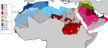

.. index::
   pair: Language ; Arabic

.. _arabic_language:

=================
Arabic Language 
=================

.. seealso:: 

   - https://fr.wikipedia.org/wiki/Arabe
   - https://en.wikipedia.org/wiki/Arabic_language

.. contents::
   :depth: 3
   
Introduction
=============

La langue arabe (العربية, al ʿarabīya) est originaire de la péninsule 
Arabique. L'expansion territoriale au Moyen Âge et la diffusion du Coran 
répandent la langue arabe, devenue langue liturgique de l'islam, en Asie 
(Moyen-Orient et Proche-Orient), en Afrique du Nord et en Europe (Chypre, 
Crète, Péninsule ibérique, Malte et Sicile). 

Parlée d'abord par les Arabes, cette langue sémitique qui se déploie 
géographiquement sur plusieurs continents s'étend sociologiquement à des 
peuples non arabes, et devient aujourd'hui langue officielle de plusieurs 
organismes internationaux.

Arabe classique
===============

Article détaillé : `Arabe classique`_.

L’arabe ancien est celui de la poésie préislamique.

L’arabe coranique est la langue du texte sacré des musulmans, le Coran, et 
les textes religieux.

L’arabe classique proprement dit est la langue de la civilisation 
arabo-musulmane.

.. _`Arabe classique`: https://fr.wikipedia.org/wiki/Arabe_classique

Arabe standard moderne
======================

Article détaillé : `Arabe standard moderne`_.

L’arabe standard moderne ou « arabe littéral » naît au début du XIXe siècle en 
Égypte, après l’introduction de l’imprimerie et les publications de livres 
modernes. Il a été adopté par les pays de l’Afrique du Nord un siècle et 
demi plus tard. 

C’est la langue écrite commune de tous les pays arabophones ;

.. _`Arabe standard moderne`: https://fr.wikipedia.org/wiki/Arabe_standard_moderne

Langues arabes vernaculaires
============================

Article détaillé : `Arabe dialectal`_.

Les langues vernaculaires orales, différentes l’une de l'autre dans chaque 
région, et influencées par l’arabe standard sont appelées arabe dialectal, 
les substrats, superstrats et emprunts différant selon les régions.

Les différences entre des dialectes moins éloignés, comme l’algérien, 
le tunisien et le marocain, ne sont pas très grandes, mais celles entre 
``l’arabe tunisien`` et ``l’arabe syrien`` le sont. (On remarquera cette 
différence à travers la prononciation et la dérivation des mots translatés de 
dialecte en dialecte. "Mon père", par exemple, passant de "abi" dans les pays 
du proche-orient à "bouya" dans les pays d'Afrique du nord). 

L'arabe est tout de même généralisé au travers de **l'arabe littéraire, enseigné 
à tous dans le système scolaire arabe**.

Les dialectes les plus importants sont l’égyptien, le chami, le maghrébin, 
hedjazi... 

Le chami est parlé en Syrie, au Liban, en Jordanie et Palestine, le Hassanya 
parlé en Mauritanie, au Maroc, au Sahara occidental et dans quelques zones 
de l'Afrique de l'Ouest.

Généralement, entre eux, les locuteurs de dialectes différents utilisent 
plutôt l’arabe littéral, ou une forme simplifiée de l’arabe littéral.

.. _`Arabe dialectal`: https://fr.wikipedia.org/wiki/Arabe_dialectal

Regroupements de dialectes
==========================

Les langues arabes, regroupées en 4 groupes principaux sont difficilement 
intercompréhensibles à l'intérieur de ces groupes, on peut donc distinguer 
une quinzaine de langues très différentes (au moins autant que les langues 
latines) au sein desquelles les variantes dialectales sont suffisamment fortes 
pour être notées.

Les variantes arabes sont issues d'une matrice elle-même diverse, la Fassiha, 
forme sémitique hétérogène, langue des poètes et sa forme "lingua franca" des 
négociations inter-tribales.

Au Maghreb par exemple, l'arabisation a commencé par l'implantation de camps 
arabes en Espagne et en province d'Afrique (Tunisie et Algérie orientale), 
à l'origine des deux langues andalouses et ifricyennes, il s'est poursuivi par 
arabisation par contamination commerciale et administrative sur la population 
"romaine" autochtone, tandis que la ruralité "barbare" a gardé la 
langue **amazighe**, les communautés urbaines maures sont apparues avec cette 
constante influence andalouse et ifricyenne, notamment à Fès, Tétouan, Tlemcen 
(etc.) et les nécessités liturgiques arabes dans ces centres universitaires, 
puis de l'arabisation administrative, surtout à partir des mérinides 
(XIIIe siècle) En parallèle, depuis le XIe siècle, et surtout le XIIIe siècle, 
des populations arabes bédouines (sinaïtes, libyennes, cyréniennes et peut-être 
yéménites) ont peuplé le Maghreb central et oriental, ainsi que les espaces 
sahariens, influençant, chacun avec leur dialecte propre (lié à leur origine 
singulière et leurs développements autonomes propres...) les populations 
berbères les plus sensibles.

Le groupe Maghrébo-Hassani, et les 3 types de langue maghrébine 
("aroubi", "maure", ifriquien) et la Hassânya, tout en gardant des différences 
fortes, n'ont cessé d'échanger à l'intérieur d'espaces cohérents, et sont 
désormais avalés par les dialectes nationaux standards.

Ils ne sont pas du tout intercompréhensibles, mais une forme de maghrébin 
simplifié permet une intercompréhension entre les commerçants par exemple, mais 
souvent le français prend le pas dans la diplomatie et le grand commerce.

Vecteurs de rayonnement de l'arabe
==================================

Un premier vecteur de rayonnement est la religion islamique. L'arabe est resté 
une langue liturgique dans la plupart des pays musulmans, bien que l'arabe 
coranique soit aujourd'hui éloigné de la langue arabe moderne.

Un second vecteur de rayonnement est la littérature en prose et poétique. 
Des écrivains non arabes ont utilisé la langue arabe pour leurs publications, 
par exemple le médecin et philosophe perse Avicenne. Les rois normands 
de Sicile se piquaient de parler l’arabe.

Un troisième vecteur de rayonnement sont les médias contemporains, journaux, 
radio, télévision (chaînes d'information panarabes, telles Al Jazeera ou Al-Arabiya), 
et les possibilités multiples de la toile (internet).

Un vecteur important plus ancien est l'emprunt à l'arabe de mots et expressions 
par les langues non-arabes, telles les langues romanes, dont le français.

