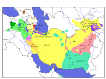

.. index::
   pair: Language ; Persian

.. _persian_language:

=================
Persian Language
=================

.. seealso::

   - https://fr.wikipedia.org/wiki/Persan
   - https://en.wikipedia.org/wiki/Persian_language
   - https://fa.wikipedia.org/wiki/%D8%B2%D8%A8%D8%A7%D9%86_%D9%81%D8%A7%D8%B1%D8%B3%DB%8C

.. contents::
   :depth: 3

Introduction
============

Le persan (فارسی), est une langue parlée en Iran (plus de 70 millions de
locuteurs), en Afghanistan (16 millions), et au Tadjikistan (7 millions) en
tant que langue officielle, ainsi qu'au Bahreïn (minorité iranophone) et
en Ouzbékistan (minorité tadjike). Il compte au total plus de 75 millions
de locuteurs et appartient au groupe indo-iranien de la famille des langues
indo-européennes. C'est une langue du type « sujet-objet-verbe ».

De nos jours, les langues persanes s’écrivent surtout au moyen de l'alphabet
perso-arabe, variante de l'alphabet arabe, bien qu'elles n'aient aucune
parenté avec la langue arabe, dont elles diffèrent tant sur le plan de la
grammaire que de la phonologie.

Au Tadjikistan et en Ouzbékistan où elle a été cyrillisée, la langue tadjike
s’écrit en caractères cyrilliques.

Dictionnaires
=============

.. seealso::

   - http://www.freelang.com/dictionnaire/iranien.php
   - http://sites.la.utexas.edu/persian_online_resources/vocabulary-lists/

Dictionnaire FREELANG : Iranien

L'iranien est une variété de persan parlée en Iran par plus de 70 millions de
locuteurs. Les autres variétés de persan sont parlées en Afghanistan (le dari)
et au Tadjikistan (le tadjik, qui s'écrit en caractères cyrilliques).

Le persan est parfois appelé "farsi", une arabisation du terme "parsi".

C'est une langue appartenant au groupe indo-iranien des langues
indo-européennes. Le persan s'écrit avec l'alphabet arabe (auquel quatre
lettres ont été ajoutées pour noter quatre sons n'existant pas en arabe).

Il existe également un système de romanisation.

Editeurs
========

python-negar
------------

.. seealso::

   - http://pypi.python.org/pypi/python-negar
   - https://github.com/shahinism/Negar.git

Negar trying to be a spell corrector for Persian language. I'm working on new
algorithm that I found from here https://github.com/aziz/virastar/blob/master/lib/virastar.rb

Tutorial
========

.. seealso::

   - http://www.persiandirect.com/projects/ipa2/ipa2_tutor.htm
   - http://farsi.irantoulouse.com/

